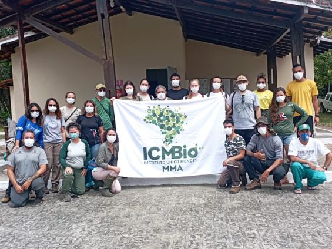

```{r setup, include=FALSE}
library(flexdashboard)
```


```{r libraries, include=FALSE}

library(tidyverse)
library(data.table)
library(descr)
library(RColorBrewer)
library(hrbrthemes)
library(kableExtra)
library(janitor)
library(skimr)
library(knitr)
library(htmltools)
library(DT)
library(leaflet)
library(sf)
library(shiny)
library(plotly)
library(ggthemes)
library(forcats)
library(crosstalk)
library(summarywidget)
library(skimr)
library(mice)
library(colorRamps)
library(readr)
library(lubridate)
library(skimr)
library(psych)
library(ggplot2)
library(formattable)
library(geobr)

options(knitr.table.format = "html")

#Sys.setlocale('LC_CTYPE','C')
Sys.setlocale("LC_ALL","pt_BR.UTF-8")

```

```{r reading data}

cursos <- read_csv2("data/cursos_cemave_2023.csv") 

participantes <- read_csv2("data/participantes_cemave_2023.csv")

alunos <- read_csv2("data/alunos_cemave_2023.csv")

instrutores <- read_csv2("data/instrutores_cemave_2023.csv")

cursos$ID <- as.character(cursos$ID)
alunos$ID <- as.character(alunos$ID)
instrutores$ID <- as.character(instrutores$ID)

cursos.alunos <- full_join(cursos, alunos, by = "ID")
cursos.instrut <- full_join(cursos, instrutores, by = "ID")

```


```{r}

# ---------- inspecionando a estrutura dos arquivos de dados e tipos de variáveis

#glimpse(cursos)

cursos$ID <- as.character(cursos$ID)
cursos$modalidade <- as.factor(cursos$modalidade)
cursos$latitude <- as.numeric(cursos$latitude)
cursos$longitude <- as.numeric(cursos$longitude)
cursos$ano <- as.factor(cursos$ano)
cursos$participantes <- as.integer(cursos$participantes)
cursos$alunos <- as.integer(cursos$alunos)
cursos$instrutores <- as.integer(cursos$instrutores)
cursos$colaboradores <- as.integer(cursos$colaboradores)
cursos$programa.curso <- as.factor(cursos$programa.curso)
cursos$lista.participantes <- as.factor(cursos$lista.participantes)
cursos$relatorio.descritivo <- as.factor(cursos$relatorio.descritivo)
cursos$fotos <- as.factor(cursos$fotos)
cursos$UF <- as.factor(cursos$UF)
#glimpse(cursos)

```


```{r resumo dos dados, include=FALSE}

# ----------- Resumo dos cursos

total_instrutores <- sum(cursos$instrutores, NA, na.rm = TRUE)
total_dias_curso <- sum(cursos$duracao.dias, NA, na.rm = TRUE)
total_horas_curso <- sum(cursos$carga.horaria, NA, na.rm = TRUE)
total_participantes <- sum(cursos$participantes, NA, na.rm = TRUE)
total_alunos <- sum(cursos$alunos, NA, na.rm = TRUE)
total_colaboradores <- sum(cursos$colaboradores, NA, na.rm = TRUE)

#summary(cursos$alunos)

#summary(cursos$instrutores)

# ---------- Contagens

#freq(cursos$foco.curso, user.missing = c("NA"))
# freq(cursos$municipio, user.missing = c("NA"))
# freq(cursos$UF, user.missing = c("NA"))
# freq(cursos$alunos, user.missing = c("NA"))
freq(cursos$ano, user.missing = c("NA"))
# freq(cursos$UF, user.missing = c("NA"))
# 
# freq(alunos$municipio, user.missing = c("NA"))
# unique(alunos$municipio)
# freq(alunos$UF, user.missing = c("NA"))
# unique(alunos$UF)
# freq(alunos$tipos.inst, user.missing = c("NA"))
# unique(alunos$tipos.inst)
# freq(alunos$instituicao, user.missing = c("NA"))
# unique(alunos$instituicao)
# 
# freq(instrutores$participantes, user.missing = c("NA"))
# freq(instrutores$genero, user.missing = c("NA"))
# freq(instrutores$instituicao, user.missing = c("NA"))
# freq(instrutores$tipos.inst, user.missing = c("NA"))
# unique(instrutores$municipio)
# freq(instrutores$UF, user.missing = c("NA"))
# unique(instrutores$UF)
# 
# unique(instrutores$instituicao)
# unique(instrutores$participantes)
# unique(instrutores$municipio)
# unique(instrutores$UF)
# 
# 
# unique(cursos$municipio)
# unique(cursos$UF)
# unique(cursos$regiao)
# unique(cursos$nome.curso)

```


Informações gerais
===


Column {data-width = 200}
-----------------------------------------------------------------------

### **Cursos ministrados**

```{r}


valueBox(dim(cursos)[1], icon = "fas fa-book-open", color = "#458B41")
```

### Dias de treinamento

```{r}

valueBox(total_dias_curso, icon = "fa-calendar", color = "#69b3a2")
```


### Horas de aula

```{r}

valueBox(total_horas_curso, icon = "fa-clock-o", color = "#69b3a2")
```


### Participantes

```{r}

valueBox(total_participantes, icon = "fa-users", color = "#69b3a2")
```


### Alunos

```{r}

valueBox(total_alunos, icon = "fa-user-graduate", color = "#69b3a2")
```


### Instrutores

```{r}

valueBox(total_instrutores, icon = "fas fa-chalkboard-teacher", color = "#69b3a2")
```


### Colaboradores

```{r}

valueBox(total_colaboradores, icon = "fas fa-people-carry", color = "#69b3a2")
```

Row {data-height = 380}
-----------------------------------------------------------------------


### **Cursos por área**

```{r echo=FALSE}

# --------------------  Cursos por tema

mycolors <- c("#dbead5", "#A2D8A2", "#677E67","#458B41", "#00AEAD")

G1 <- cursos %>%
        #filter(!is.na(foco.curso)) %>% 
        mutate(foco.curso = ifelse(is.na(foco.curso), "Sem informação", foco.curso)) %>% 
        group_by(foco.curso) %>%
        summarise(count = n()) %>%
        plot_ly(labels = ~foco.curso,
        values = ~count,
        marker = list(colors = mycolors)) %>%
        add_pie(hole = 0.4) %>%
        layout(xaxis = list(zeroline = F,
                    showline = F,
                    showticklabels = F,
                    showgrid = F),
       yaxis = list(zeroline = F,
                    showline = F,
                    showticklabels=F,
                    showgrid=F))
G1

```


### **Cursos por duração (em dias)**

```{r}

G4 <- cursos %>%
    filter(!is.na(duracao.dias)) %>% 
    ggplot( aes(x = duracao.dias)) +
    geom_histogram(binwidth=1, fill="#69b3a2", color="#e9ecef", alpha=0.9) +
    scale_x_continuous(name = " ") +
    scale_y_continuous(name = " ") +
    theme_minimal() +
    theme(
    panel.grid.minor.y = element_blank(),
    panel.grid.major.y = element_blank(),
    panel.grid.minor.x = element_blank(),
    panel.grid.major.x = element_blank(),
    ) +
    scale_x_continuous(breaks = seq(0, 17, by = 1), name = " ") +
    scale_y_continuous(breaks = seq(0, 20, by = 5), name = " ")

 
ggplotly(G4)

```


### **Cursos por carga horária**

```{r}

G5 <- cursos %>%
    ggplot( aes(x = carga.horaria)) +
    geom_histogram( binwidth=8, fill="#69b3a2", color="#e9ecef", alpha=0.9) +
    theme_minimal() +
    theme(
    panel.grid.minor.y = element_blank(),
    panel.grid.major.y = element_blank(),
    panel.grid.minor.x = element_blank(),
    panel.grid.major.x = element_blank(),
    ) +
    scale_x_continuous(breaks = seq(0, 120, by = 40), name = " ") +
    scale_y_continuous(name = " ") 
      


ggplotly(G5)

```


Row {data-height = 380}
-------------------------------------------------------------------

### **Cursos por década**

```{r}

# ------------------------- Número de cursos por década

tempo.decada <- data.frame(
  decada = c("1978-79", "1980-89", "1990-99", "2000-09", "2010-19", "2020-29"),
  cursos = c(2, 18, 43, 6, 22, 4)
)

G7 <- tempo.decada %>%
    ggplot( aes(x = decada, y = cursos)) +
    geom_col(color = "#e9ecef",  fill="#69b3a2") +
    geom_text(aes(label = cursos)) +
    ylim(0, 45) +
    scale_x_discrete(name = " ") +
    scale_y_continuous(name = " ") +
    theme_minimal() +
   
    theme(
    panel.grid.minor.y = element_blank(),
    panel.grid.major.y = element_blank(),
    panel.grid.minor.x = element_blank(),
    panel.grid.major.x = element_blank(),
    )
   
    
ggplotly(G7)

```


### **Cursos por estado**

```{r cursos por estado}
# ----------------------  Barplot cursos por estado horizontal

G8 <- cursos %>%
        filter(!is.na(UF)) %>% 
        filter(!UF == 'ARG') %>% 
        group_by(UF) %>%
        summarise(count = n()) %>% 
   
        ggplot(aes(x = fct_reorder(UF, count, .desc = F), y = count)) +
        geom_bar(stat="identity", fill="#69b3a2") +
        coord_flip() +
        theme_minimal() +
        theme(
        panel.grid.minor.y = element_blank(),
        panel.grid.major.y = element_blank(),
        legend.position="none") +
        xlab(" ") +
        ylab(" ")

ggplotly(G8)


```


### **Cursos por região**

```{r}

coul5 <- brewer.pal(5, "Pastel2")

G9 <- cursos %>%
        mutate(regiao = recode(UF, "DF" = "Centro-Oeste",
                                   "MT" = "Centro-Oeste",
                                   "MS" = "Centro-Oeste",
                               "TO" = "Centro-Oeste",
                               "DF" = "Distrito Federal", 
                               "AM" = "Norte",
                               "AC" = "Norte",
                               "PA" = "Norte",
                               "RO" = "Norte",
                               "RR" = "Norte",
                               "AP" = "Norte",
                               "BA" = "Nordeste",
                               "CE" = "Nordeste",
                               "MA" = "Nordeste",
                               "PB" = "Nordeste", 
                               "PE" = "Nordeste",
                               "PI" = "Nordeste",
                               "RN" = "Nordeste",
                               "SE" = "Nordeste",
                               "AL" = "Nordeste",
                               "RJ" = "Sudeste",
                               "MG" = "Sudeste",
                               "SP" = "Sudeste",
                               "ES" = "Sudeste",
                               "RS" = "Sul",
                               "PR" = "Sul",
                               "SC" = "Sul")) %>% 
        filter(!is.na(regiao)) %>% 
        filter(!UF == 'ARG') %>% 
        group_by(regiao) %>%
        summarise(count = n()) %>%  
        ggplot( aes(x = fct_reorder(regiao, count, .desc = TRUE), y = count)) +
        geom_col(color = "#e9ecef",  fill= coul5) +
        scale_x_discrete(name = " ") +
        scale_y_continuous(name = " ") +
        theme_minimal() +
        theme(
        panel.grid.minor.y = element_blank(),
        panel.grid.major.y = element_blank(),
        panel.grid.minor.x = element_blank(),
        panel.grid.major.x = element_blank(),
    )
   
ggplotly(G9)

```


Alunos
=========================

Row
-------------------------------------------------------------------

### **Alunos por curso**

```{r imagem Alunos por curso}

# ------------------------  Boxplot - Média de Alunos por curso

fill <- "#69B3A2"
line <- "#767f6d"


G2 <- ggplot(cursos, aes(y = alunos)) +
        geom_boxplot(fill = fill, colour = line, outlier.colour = "#D92926") +
        scale_x_discrete(name = "Alunos") +
        scale_y_continuous(name = "") +
        theme_minimal() +
        theme(
        panel.grid.minor.y = element_blank(),
        panel.grid.major.y = element_blank(),
        panel.grid.minor.x = element_blank(),
        panel.grid.major.x = element_blank()
        ) +
        scale_y_continuous(breaks = seq(0, 120, by = 10), name = " ")

ggplotly(G2)

```

### **Cursistas por gênero**

```{r imagem Cursistas por gênero}

# --------------------  Cursistas por gênero

G10 <- alunos %>%
        mutate(genero = ifelse(genero == "M", "Homem", "Mulher")) %>% 
        filter(!is.na(genero)) %>% 
        group_by(genero) %>%
        summarise(count = n()) %>%
        
        plot_ly(labels = ~genero,
                 values = ~count,
                 marker = list(colors = mycolors)) %>%
        add_pie(hole = 0.4) %>%
        layout(xaxis = list(zeroline = F,
                             showline = F,
                             showticklabels = F,
                             showgrid = F),
                yaxis = list(zeroline = F,
                             showline = F,
                             showticklabels=F,
                             showgrid=F))
G10

```


### **Origem dos alunos por área de atuação**

```{r imagem Áreas de atuação}

# ---------------------  Alunos por áreas de atuação

# origem <- data.frame(
#   area.atuacao = c("Órgãos Ambientais", "Forças Segurança", "Ensino & Pesquisa", "Museus & Afins", "Terceiro Setor", "Empresas", "Área Jurídica"),
#   numero = c(224, 213, 137, 18, 18, 12, 5)
# )

# Usando uma palheta de cores

coul1 <- brewer.pal(8, "Pastel2") 


G11 <- alunos %>%
        filter(!is.na(tipos.inst)) %>% 
        group_by(tipos.inst) %>%
        summarise(count = n()) %>% 

        ggplot( aes(x = fct_reorder(tipos.inst, count, .desc = FALSE), y = count)) +
        geom_col(color = "#e9ecef",  fill= coul1) +
        ylim(0, 300) +
        scale_y_continuous(name = " ") +
        scale_x_discrete(name = " ", labels = c('Órgãos Ambientais', 'Forças de Segurança', 'Ensino & Pesquisa', 'Terceiro Setor', 'Museus & Afins', 'Empresas', 'Consultoria', 'Setor Jurídico')) +
        coord_flip() +
        theme_minimal() +
        theme(
        panel.grid.minor.y = element_blank(),
        panel.grid.major.y = element_blank(),
        panel.grid.minor.x = element_blank(),
        #panel.grid.major.x = element_blank(),
        )

ggplotly(G11)

```


Row
-------------------------------------

### **Alunos por estado**

```{r imagem Alunos por estado}

# ----------------------  Alunos por estado 


G12 <- alunos %>%
        filter(!is.na(UF)) %>% 
        filter(!UF == 'ARG') %>% 
        group_by(UF) %>%
        summarise(count = n()) %>% 
 
        ggplot(aes(x = fct_reorder(UF, count, .desc = F), y = count)) +
        geom_bar(stat="identity", fill="#69b3a2") +
        coord_flip() +
        theme_minimal() +
        theme(
        panel.grid.minor.y = element_blank(),
        panel.grid.major.y = element_blank(),
        ) +
        xlab(" ") +
        ylab(" ")

ggplotly(G12)

```


### **Alunos por região**

```{r imagem Alunos por região}

# ----------------------------  Alunos por região

coul2 <- brewer.pal(5, "Pastel2") 

G13 <-  alunos %>%
        filter(!is.na(regiao)) %>% 
        filter(!regiao == 'ARG') %>% 
        group_by(regiao) %>%
        summarise(count = n()) %>% 

        ggplot( aes(x = fct_reorder(regiao, count, .desc = T), y = count)) +
        geom_col(color = "#e9ecef",  fill= coul2) +
        scale_x_discrete(name = "") +
        scale_y_continuous(name = "") +
        theme_minimal() +
        theme(
        panel.grid.minor.y = element_blank(),
        panel.grid.major.y = element_blank(),
        panel.grid.minor.x = element_blank(),
        panel.grid.major.x = element_blank(),
        )
   
ggplotly(G13)

```


### **Alunos estrangeiros**

```{r imagem Alunos estrangeiros}

# ---------------------------  Alunos por país

# alunos.pais <- data.frame(
#   pais = c("Brasil", "Bolívia", "Argentina", "Peru"), 
#   alunos = c(878, 8, 3, 1)
# )

coul3 <- brewer.pal(6, "Pastel2")


G14 <-  alunos %>%
        filter(!is.na(pais)) %>%
        filter(pais != "Brasil") %>% 
        group_by(pais) %>%
        summarise(count = n()) %>% 

        ggplot(aes(x = fct_reorder(pais, count, .desc = T), y = count)) +
        geom_col(color = "#e9ecef",  fill= coul3) +
        scale_x_discrete(name = "") +
        scale_y_continuous(name = " ") +
        #scale_y_log10(name = " ") +
        theme_minimal() +
        theme(
        panel.grid.minor.y = element_blank(),
        panel.grid.major.y = element_blank(),
        panel.grid.minor.x = element_blank(),
        panel.grid.major.x = element_blank(),
        ) +
        scale_y_continuous(breaks = seq(0, 10, by = 2), name = " ")
   
ggplotly(G14)

```

Instrutoria
=======================

Row 
---------------------------------------------------------------------

### **Instrutores por curso**

```{r imagem Instrutores por curso}

# ------------------------  Boxplot - Instrutores por curso


G3 <- ggplot(cursos, aes(y = instrutores)) +
        geom_boxplot(fill = fill, colour = line, outlier.colour = "#D92926") +
        scale_x_discrete(name = "Instrutores") +
        scale_y_continuous(name = "") +
        theme_minimal() +
        theme(
        panel.grid.minor.y = element_blank(),
        panel.grid.major.y = element_blank(),
        ) +
        #theme(axis.line = element_line(colour = "#FFFFFF", size = 1)
        scale_y_continuous(breaks = seq(0, 17.5, by = 2.5), name = " ")
       
ggplotly(G3)

```

### **Ações de instrutoria por estado de origem do instrutor**

```{r imagem Instrutoria por estado}

# -----------------------   Instrutoria por estado


G15 <-  instrutores %>%
        filter(!is.na(UF)) %>% 
        group_by(UF) %>%
        summarise(count = n()) %>% 

        ggplot(aes(x = fct_reorder(UF, count, .desc = T), y = count)) +
        geom_col(fill="#69b3a2") +
        xlab("Estados") +
        ylab(" ") +
        theme_minimal() +
        theme(
        panel.grid.minor.y = element_blank(),
        panel.grid.major.y = element_blank(),
        panel.grid.minor.x = element_blank(),
        panel.grid.major.x = element_blank(),
        ) 

ggplotly(G15)

```


Row 
---------------------------------------------------------------------
### **Instrutores mais ativos**


```{r imagem Instrutores mais ativos}

# -------------------------  Instrutores mais ativos

G16 <-  instrutores %>%
        group_by(participantes) %>%
        summarise(count = n()) %>% 
        arrange(desc(count)) %>% 
        filter(count > 3) %>% 

        ggplot(aes(x = fct_reorder(participantes, count, .desc = F), y = count)) +
        geom_col(color = "#e9ecef",  fill="#69b3a2") +
        coord_flip() +
        theme_minimal() +
        theme(
        panel.grid.minor.y = element_blank(),
        panel.grid.major.y = element_blank(),
        ) +
        xlab(" ") +
        ylab("Cursos ministrados") +
        scale_y_continuous(limits=c(0, 10)) +
        scale_y_continuous(breaks = seq(0, 10, by = 2), name = "Cursos ministrados ")
 
ggplotly(G16)
 
```

### **Áreas de atuação de origem dos instrutores**

```{r Áreas de atuação de origem dos instrutores}

# ---------------------  Instrutores por origem

categorias.instrutores <- data.frame(
  origem = c("Órgãos Ambientais", "Ensino & Pesquisa", "Terceiro Setor", "Museus & Afins", "Forças Segurança", "Empresas"),
  numero = c(119, 31, 23, 4, 2, 1)
)

#coul4 <- brewer.pal(6, "Pastel2") 

color <- colorRampPalette(c("darkgreen","lightgreen"))
color(6)


G17 <-  instrutores %>%
        filter(!is.na(tipos.inst)) %>% 
        group_by(tipos.inst) %>%
        summarise(count = n()) %>% 
      
        ggplot(aes(x = fct_reorder(tipos.inst, count, .desc = F), y = count)) +
        geom_col(color = "#e9ecef",  fill= color(6)) +
        scale_x_discrete(name = " ") +
        scale_y_continuous(name = "Número de instrutores") +
        scale_x_discrete(name = " ", labels = c('Empresas', 'Forças de Segurança', 'Museus & Afins',  'Terceiro Setor',  'Ensino & Pesquisa', 'Órgãos Ambientais')) +
        coord_flip() +
        theme_minimal() +
        theme(
        panel.grid.minor.y = element_blank(),
        panel.grid.major.y = element_blank(),
        ) 
   
ggplotly(G17)

```

Espacialização {data-orientation=columns}
=======================

Column 1 {data-width=400}
-------------------------------------------------------------------


### **Cursos por região**

```{r leitura e pré-processamento dos dados - cursos por região, echo = FALSE}

sf_use_s2(FALSE) # esse código, do pacote sf, serve para ajustar erro de geometria dos polígonos que apareceu após a atualização de versão e permitir a união dos dois shapes abaixo

regioes_sf <- st_read("shapes/regioes_2010.shp", quiet = TRUE)

regioes_sf <- rename(regioes_sf, regiao = nome)

# mapa_regiao <- 
# mapa_regiao <- geobr::read_region()
# 
# mapa_regiao <- mapa_regiao %>% 
#     rename(regiao = name_region)

# mapa_regiao <- mapa_regiao %>%
#         mutate(regiao = recode(regiao, "Centro Oeste" = "Centro-Oeste"))

```


```{r mapa cursos por região, echo = FALSE}

#crs <- leafletCRS(proj4def = "+proj=longlat +datum=WGS84")


cursos_regiao <- data.frame(
    regiao = c("Norte", "Nordeste", "Centro-Oeste", "Sudeste", "Sul"),
    cursos = c(3, 21, 34, 13, 21))

#mapa_regiao <- mapa_regiao %>% st_transform(4326)

dados_mapa_regiao = regioes_sf %>% 
    left_join(cursos_regiao)


legendas_regiao <- dados_mapa_regiao %>% mutate(popup_info = paste (regiao)) # criando uma coluna na tabela de dados com os dados que serão mostrados na janela popup


# dados_mapa_regiao <- dados_mapa_regiao %>% st_transform(4326)

bins <- c(0, 10, 20, 30, 40)
qpal2 = colorBin("Greens", dados_mapa_regiao$cursos, bins = bins)

labels <- sprintf("<strong>%s</strong>", dados_mapa_regiao$cursos) %>% lapply(htmltools::HTML)

mapa_cursos_regiao <- dados_mapa_regiao %>% 
    leaflet() %>%
    setView(lng = -58, lat = -14,
           zoom = 4) %>%
    addPolygons(stroke = TRUE,
              opacity = 1.0,
              fillOpacity = 1.0,
              smoothFactor = 0.5,
              color = "white",
              fillColor = ~qpal2(dados_mapa_regiao$cursos),
              weight = 1,
              label = labels,
              popup = ~legendas_regiao$popup_info,
              labelOptions = labelOptions(
                style = list("font-weight" = "normal",
                             padding = "3px 8px"),
                             textsize = "15px",
                             direction = "auto"),
              highlight = highlightOptions(weight = 1, 
                                 color = "grey",
                                 fillOpacity = 0.9,
                                 bringToFront = T)) %>% 
 
    addLegend(values = ~dados_mapa_regiao$cursos,
             pal = qpal2,
             position = "bottomleft",
             title = "Cursos por região")

mapa_cursos_regiao

```


### **Cursos por estado**


```{r leitura e pré-processamento dos dados - cursos por estado, echo = FALSE}


sf_use_s2(FALSE) # esse código, do pacote sf, serve para ajustar erro de geometria dos polígonos que apareceu após a atualização de versão e permitir a união dos dois shapes abaixo

estados_sf <- st_read("shapes/estados_2010.shp", quiet = TRUE)

estados_sf <- rename(estados_sf, UF = sigla)

# mapa_estado <- geobr::read_state()
# mapa_estado <- mapa_estado %>%
#     rename(UF = abbrev_state)
# mapa_estado <- mapa_estado %>% 
#     rename(regiao = name_region)
# 
# mapa_estado <- mapa_estado %>%
#         mutate(name_state = recode(name_state, "Rio Grande Do Norte" = "Rio Grande do Norte",
#                "Rio Grande Do Sul" = "Rio Grande do Sul",
#                "Mato Grosso Do Sul" = "Mato Grosso do Sul",
#                "Rio De Janeiro" = "Rio de Janeiro"))

# mapa_estado <- mapa_estado %>%
#         mutate(regiao = recode(regiao, "Centro Oeste" = "Centro-Oeste"))   

# cursos2 <- cursos %>%
#     filter(!is.na(UF)) %>%
#     filter(UF != "ARG") %>% 
#         mutate(regiao = recode(UF, "DF" = "Centro-Oeste",
#                                    "MT" = "Centro-Oeste",
#                                    "MS" = "Centro-Oeste",
#                                "TO" = "Centro-Oeste",
#                                "DF" = "Distrito Federal", 
#                                "AM" = "Norte",
#                                "AC" = "Norte",
#                                "PA" = "Norte",
#                                "RO" = "Norte",
#                                "RR" = "Norte",
#                                "AP" = "Norte",
#                                "BA" = "Nordeste",
#                                "CE" = "Nordeste",
#                                "MA" = "Nordeste",
#                                "PB" = "Nordeste", 
#                                "PE" = "Nordeste",
#                                "PI" = "Nordeste",
#                                "RN" = "Nordeste",
#                                "SE" = "Nordeste",
#                                "AL" = "Nordeste",
#                                "RJ" = "Sudeste",
#                                "MG" = "Sudeste",
#                                "SP" = "Sudeste",
#                                "ES" = "Sudeste",
#                                "RS" = "Sul",
#                                "PR" = "Sul",
#                                "SC" = "Sul"))
# 
# cursos2
# glimpse(mapa_estado)
# glimpse(cursos2)
# 
# cursos2$UF <- as.character(cursos2$UF)
# cursos2$regiao <- as.character(cursos2$regiao)
# 
# glimpse(mapa_estado)
# glimpse(cursos2)

# dados_mapa = mapa_estado %>% 
#     left_join(cursos2)

# Plotando os mapas em ggplot

    
# G18 <-  dados_mapa %>%
#         group_by(UF) %>%
#         summarise(count = n()) %>% 
#        
#         ggplot()  +
#             
#     geom_sf(aes(fill = count))
#   #data = NULL,
#   # stat = "sf",
#   # position = "identity",
#   # na.rm = FALSE,
#   # show.legend = NA,
#   # inherit.aes = TRUE)
# 
#             # scale_fill_distiller(pallete = "Reds", direction = 1,
#             #     name = "Cursos por estado", limits = c(1, 30))
# G18
        

```


```{r mapa cursos por estados, echo = FALSE}

cursos_estado <- data.frame(
   UF = c("AM", "BA", "CE", "DF", "ES", "MA", "MG", "MS", "MT", "PA", "PB", "PE", "PI", "PR", "RJ", "RN", "RS", "SC", "SP", "RO", "RR", "AC", "TO", "SE", "AL", "GO", "AP"),
    cursos = c(1, 2, 4, 22, 2, 2, 1, 9, 3, 2, 6, 4, 1, 4, 3, 2, 11, 6, 7, 0, 0, 0, 0, 0, 0, 0, 0))

dados_mapa_estados = estados_sf %>% 
    left_join(cursos_estado)

legendas_estados <- dados_mapa_estados %>% mutate(popup_info = paste (UF)) # criando uma coluna na tabela de dados com os dados que serão mostrados na janela popup

bins <- c(0, 4, 8, 12, 14, 16, 20, 24)
qpal = colorBin("Greens", dados_mapa_estados$cursos, bins = bins)


labels <- sprintf("<strong>%s</strong>", dados_mapa_estados$cursos) %>% lapply(htmltools::HTML)

mapa_cursos_estados <- dados_mapa_estados %>% 
    leaflet() %>%
    setView(lng = -58, lat = -14,
           zoom = 4) %>%
    addPolygons(stroke = TRUE,
              opacity = 1.0,
              fillOpacity = 1.0,
              smoothFactor = 0.5,
              color = "white",
              fillColor = ~qpal(dados_mapa_estados$cursos),
              weight = 1,
              label = labels,
              popup = ~legendas_estados$popup_info,
              labelOptions = labelOptions(
                style = list("font-weight" = "normal",
                             padding = "3px 8px"),
                             textsize = "15px",
                             direction = "auto"),
              highlight = highlightOptions(weight = 1, 
                                 color = "grey",
                                 fillOpacity = 0.9,
                                 bringToFront = T)) %>% 
 
    addLegend(values = ~dados_mapa_estados$cursos,
             pal = qpal,
             position = "bottomleft",
             title = "Cursos por estado")

mapa_cursos_estados

```


Column 2 {data-width=600}
------------------


### **Locais dos cursos e de origem dos alunos e instrutores**

```{r Locais dos cursos e origem de alunos e instrutores }


# Insere Awesome icons

# icon1 <- awesomeIcons(
#   icon = 'fa-binoculars',
#   iconColor = 'brown',
#   library = 'fa',
#   markerColor = "white"
# )


mapa_cursos <- cursos %>% mutate(popup_info = paste ("Treinamento:", nome.curso, "<br/>", "Realizado em:", ano, "<br/>", "Local:", local.curso, "<br/>", "Cidade:", municipio, "<br/>","Estado:", UF, "<br/>", "Modalidade:", modalidade, "<br/>", "Duração em dias:", duracao.dias, "<br/>", "Carga Horária:", carga.horaria)) # criando uma coluna na tabela de dados com os dados que serão mostrados na janela popup

mapa_alunos <- cursos.alunos %>% mutate(popup_info = paste ("Aluno:", participantes.y, "<br/>", "Treinamento:", nome.curso, "<br/>", "Ano de participação:", ano.y, "<br/>", "Instituição de origem:", instituicao, "<br/>", "Local de origem:", municipio.y, "<br/>","UF:", UF.y)) # criando uma coluna na tabela de dados com os dados que serão mostrados na janela popup

mapa_instrutores <- cursos.instrut %>% mutate(popup_info = paste ("Instrutores:", instrutores.origem, "<br/>", "Treinamento:", nome.curso, "<br/>", "Ano de realização:", ano.y, "<br/>")) # criando uma coluna na tabela de dados com os dados que serão mostrados na janela popup


mapa <- leaflet() %>%
  #Base groups
  setView(lng = -58, lat = -14,
           zoom = 4) %>%
  #addProviderTiles(providers$Esri.WorldImagery, group = "Imágenes de ESRI") %>%
  addProviderTiles(providers$Stamen.TonerLite, group = "Stamen Toner Lite") %>%
  #addProviderTiles(providers$OpenStreetMap.Mapnik, group = "Open Street Map") %>%
    # Overlay groups
    
    # addTiles() %>% 
    addCircleMarkers(data = mapa_cursos,
                     lat = ~latitude,
                     lng = ~longitude,
                     #icon = icon1,
                     radius = ~3,
                     group = "Cursos",
                     color = "darkgreen",
                     popup = ~popup_info) %>% # inserindo a janela popup no código
    
    addCircleMarkers(data = mapa_alunos,
                     lat = ~latitude.y,
                     lng = ~longitude.y,
                     radius = ~3,
                     group = "Alunos",
                     color = "gray",
                     popup = ~popup_info) %>% # inserindo a janela popup no código
   
    addCircleMarkers(data = mapa_instrutores,
                    lat = ~latitude.y,
                    lng = ~longitude.y,
                    radius = ~3,
                    group="Instrutores",
                    color = "brown",
                    popup = ~popup_info) %>%  # inserindo a janela popup no código
   
# Layers Control

    addLayersControl(
        baseGroups = c(#"OpenStreetMap",
                       "Stamen Toner Lite)"),
                       #"Imágenes de ESRI"), 
        overlayGroups = c("Cursos",
                          "Alunos",
                          "Instrutores"),
        options = layersControlOptions(collapsed = FALSE,
                                       autoZIndex = TRUE)) %>%
  addEasyButton(easyButton(
    icon="fa-globe", title="Zoom to Level 4",
    onClick=JS("function(btn, map){ map.setZoom(4); }"))) %>% 
  addMeasure(
    position = "bottomleft",
    primaryLengthUnit = "meters",
    primaryAreaUnit = "sqmeters",
    activeColor = "#3D535D",
    completedColor = "#7D4479")

mapa %>% hideGroup(c("Alunos", "Instrutores"))

```


Lista dos cursos 
=========================

Row {data-height = 200}
-------------------------------------------------------------------

### **Cursos por ano**

```{r figura cursos por ano, echo = FALSE}

cursos_tempo <- data.frame(
  ano = c("1978", "1979", "1980", "1981", "1982", "1983", "1984", "1985", "1986", "1987", "1988", "1989", "1990", "1991", "1992", "1993", "1994", "1995", "1996", "1997", "1998", "1999", "2000", "2001", "2002", "2003", "2004", "2005", "2006", "2007", "2008", "2009", "2010", "2011", "2012", "2013", "2014", "2015", "2016", "2017", "2018", "2019", "2020", "2021", "2022"),
  cursos = c(1,  1,  1, 1, 3, 3, 0, 1, 1, 2, 4, 2, 3, 9, 0, 6, 7, 5, 2, 4, 4, 3,     3, 0, 0, 0, 0, 0, 2, 0, 1, 0, 0, 2, 1, 1, 1, 3, 1, 2, 6, 5, 1, 0, 3))

G50 <- cursos_tempo %>%
        ggplot(aes(ano, cursos, group = 1)) +
        geom_point(color = "#69b3a2", size = 2) +
        geom_line(color = "#008000") +
        theme_minimal() + 
        theme(
        #panel.grid.minor.y = element_blank(),
        #panel.grid.major.y = element_blank(),
        panel.grid.minor.x = element_blank(),
        panel.grid.major.x = element_blank(),
        ) +
        xlab("Ano") +
        ylab(" ") +
        #ylim(0, 10) +
        scale_y_continuous(breaks = seq(0, 12, by = 2))

ggplotly(G50)
   
```

Row {data-height=800 .tabset .tabset-fade}
-------------------------------------------------------------------

### **Lista de cursos**

```{r lista de cursos}


tabela_cursos <- subset(cursos, select = -c(ID, periodo, carga.horaria,  organizadores, categoria, latitude, longitude, instrutores.origem, programa.curso, lista.participantes, relatorio.descritivo, fotos, origem.informacoes, observacoes))

tab1 <- tabela_cursos %>% 
    select(ano, nome.curso, foco.curso, modalidade, duracao.dias, local.curso, municipio, UF, participantes, alunos, instrutores, colaboradores) %>% 
    arrange(desc(ano))

lista_cursos <- datatable(tab1,
          caption = 'Tabela 1. Lista de cursos ministrados pelo CEMAVE de 1978 a 2022.',
          
          colnames = c('Ano', 'Nome do curso', 'Tema', 'Modalidade', 'Duração (dias)', 'Local', 'Município', 'UF',  'Nº Participantes', 'nº Alunos', 'Nº Instrutores', 'Nº Colaboradores'),
          
          extensions = 'Buttons',
                           elementId = NULL,
                           # extensions= "Scroller",
                           style="bootstrap",
                           class="stripe hover",
                           width="80%",
                           rownames = F,
                           autoHideNavigation = T,
                           escape =FALSE,
                           filter = "top",
                           options=list(deferRender=TRUE,
                                   pageLength = 15,
                                   scrollY=300,
                                   dom = 'Bfrtip', 
                         buttons = c('copy', 'csv', 'excel', 'pdf')))

#formattable(tab1, 
            #align =c("c","l", "l", "l", "c", "l", "l", "l", "c", "c", "c", "c"))
            #list(`Especie` = formatter("span", style = ~ style(color = "grey",font.style = "italic"))))

lista_cursos  
    
    
```


### **Lista de participantes**

```{r lista de participantes, echo = FALSE}


# tabela_participantes <- subset(participantes, select = -c(categ, genero, tipo.inst, latitude, longitude))
# 
# tab_participantes <- tabela_participantes %>% 
#     #filter(is.na()) %>%
#     arrange(desc(ano), desc(ID), curso, UF, participantes) %>% 
#     select(- ID)
# 
# 
#     
# 
# 
# 
#     
# lista_cursos <- datatable(tab_participantes,
#           caption = 'Tabela 2. Lista de participantes nos cursos ministrados pelo CEMAVE de 1978 a 2022.',
#           
#           colnames = c('Ano', 'curso', 'Participante', 'Condição', 'Instituição', 'Tipo de Instituição', 'Município', 'UF', 'Região', 'País'),
#           
#           extensions = 'Buttons',
#                            elementId = NULL,
#                            # extensions= "Scroller",
#                            style="bootstrap",
#                            class="stripe hover",
#                            width="80%",
#                            rownames = F,
#                            autoHideNavigation = T,
#                            escape =FALSE,
#                            filter = "top",
#                            options=list(deferRender=TRUE,
#                                    pageLength = 15,
#                                    scrollY=300,
#                                    dom = 'Bfrtip', 
#                          buttons = c('copy', 'csv', 'excel', 'pdf')))
# 
# lista_cursos  
    
    # formattable(ameacadas, 
#             align =c("l","l","c"), list(`Especie` = formatter("span", style = ~ style(color = "grey",font.style = "italic"))))

```

                           
    
<!-- formatStyle('Taxon',  fontWeight = 'italic', fontStyle = 'italic', `text-align` = 'left') %>%  -->

<!-- formatStyle(columns = c("Nome.comum"), `text-align` = 'left') %>% -->
<!-- formatStyle(columns = c("Familia"), `text-align` = 'center') %>% -->
<!-- formatStyle(columns = c("Status.global"), `text-align` = 'center') %>% -->
<!-- formatStyle(columns = c("Status.nacional"), `text-align` = 'center') %>% -->
<!-- formatStyle(columns = c("Area.de.ocorrencia.predominante"), `text-align` = 'center') %>% -->

Imagens de campo {.storyboard}
=========================================

### **Curso Básico de Anilhamento de Aves Silvestres - Parte Prática** - Tesrva Biológica de Guaribas - Mamanguape, PB


```{r imagens1}

 


```

***

**Alunos**

- Maria José dos Santos
- Paulino Lopes
- Jorge Matias
- Paulo Marcos
- Roberto Justus

**Instrutores**

**22 a 28/03/2022**

### **Curso Básico de Anilhamento de Aves Silvestres - Parte Prática** - Tesrva Biológica de Guaribas - Mamanguape, PB


```{r imagens2}

 


```

***

**Alunos**

- Maria José dos Santos
- Paulino Lopes
- Jorge Matias
- Paulo Marcos
- Roberto Justus

**Instrutores**

**22 a 28/03/2022**


### **Curso Básico de Anilhamento de Aves Silvestres - Parte Prática** - Tesrva Biológica de Guaribas - Mamanguape, PB


```{r imagens3}

 


```

***

**Alunos**

- Maria José dos Santos
- Paulino Lopes
- Jorge Matias
- Paulo Marcos
- Roberto Justus

**Instrutores**

**22 a 28/03/2022**


### **Curso Básico de Anilhamento de Aves Silvestres - Parte Prática** - Tesrva Biológica de Guaribas - Mamanguape, PB


```{r imagens4}

 


```

***

**Alunos**

- Maria José dos Santos
- Paulino Lopes
- Jorge Matias
- Paulo Marcos
- Roberto Justus

**Instrutores**

**22 a 28/03/2022**


### **Curso Básico de Anilhamento de Aves Silvestres - Parte Prática** - Tesrva Biológica de Guaribas - Mamanguape, PB


```{r imagens5}

 


```

***


**Alunos**

- Maria José dos Santos
- Paulino Lopes
- Jorge Matias
- Paulo Marcos
- Roberto Justus

**Instrutores**

**22 a 28/03/2022**


Sobre {data-orientation=columns}
======================================


Column-1 {data-width=500}
------------------------------------------------------------------

### **Relatório** - Última atualização: **05/04/2023**


#### **Os cursos ministrados pelo CEMAVE**

Este relatório apresenta os resultados do processo de compilação, sistematização e análise de dados relativos aos cursos ministrados pelo Centro Nacional de Pesquisa e Conservação de Aves Silvestres – CEMAVE no período de 1978 a 2020. A iniciativa teve como objetivos sistematizar o esforço de capacitação realizado pelo Centro ao longo de sua existência e disponibilizar essa informação ao público em geral. Como para alguns cursos (especialmente os mais antigos) foram obtidas apenas informações parciais, nos  resultados aqui apresentados o número de registros considerados para diferentes variáveis pode diferir, a depender do aspecto avaliado. Apesar das lacunas detectadas nos registros levantados, procurou-se extrair a maior quantidade possível de informações dos dados disponíveis.

Nas primeiras décadas predominaram no CEMAVE os cursos sobre aves com foco em atividades práticas em campo (p. ex.: capturas com redes de neblina, anilhamento, identificação e registros comportamentais) e que incluiam a execução de pequenos projetos em grupo ou individualmente. Os cursos eram, em geral, mais longos (9, 10, 11, até 17 dias). Com o passar dos anos houve uma tendência de redução na duração dos cursos, com uma progressiva convergência para o predomínio de cursos com 5 dias (40 horas – uma semana). Esses treinamentos, com foco nas atividades práticas de campo e capacitação para o anilhamento estão, até hoje, fortemente associados à imagem institucional do CEMAVE como centro especializado em pesquisa e conservação de aves, nacionalmente conhecido e reconhecido pela comunidade ornitológica do país. As iniciativas de capacitação do Centro estão intrinsicamente ligadas ao seu próprio processo de criação e ao interesse e necessidade existentes, à época, na formação de profissionais para atuar na pesquisa e conservação de aves no Brasil.  

Ao longo dos anos o Centro ministrou também cursos de menor duração, voltados à capacitação de um público atuante na área de fiscalização/proteção e reabilitação de aves (cursos voltados especialmente aos fiscais do Ibama, de órgãos ambientais estaduais e também a profissionais de Centros de Triagem de Animais Silvestres - CETAS). A demanda por esse tipo de curso vem aumentando em anos recentes, reflexo possivelmente também das ações previstas nos Planos de Ação Nacionais para a conservação de espécies ameaçadas. Nos últimos anos têm surgido ainda demandas pontuais no âmbito acadêmico para cursos mais teóricos sobre biologia e conservação de aves e sobre as ações desenvolvidas pelo CEMAVE, incluindo treinamentos para o uso de aves em programas de monitoramento. Esse cenário geral parece ter contribuído para o aumento do número de cursos ministrados no período de 2010 a 2020.

Os cursos ministrados pelo CEMAVE têm uma grande abrangência tanto em termos geográficos quanto em termos da área de atuação de origem dos alunos. Já ministramos cursos em grande parte dos estados brasileiros, alcançando alunos com diferentes perfis de atuação profissional, provenientes de 26 estados e de todas as regiões do país, além de alguns alunos de países vizinhos. Atualmente há espaço para ampliação do número de participantes provenientes de instituições de ensino e pesquisa, seja como cursistas ou como instrutores.


Interessado em participar de um curso oferecido pelo CEMAVE?  

Visite regularmente [nosso site](https://www.icmbio.gov.br/cemave) e siga nosso [instagram](https://www.instagram.com/icmbio.cemave/?hl=pt) para receber informações sobre o lançamento dos editais para nossos treinamentos.  


Documento gerado em **'`r format(Sys.Date(), "%d %B de %Y")`'**.


Column-2 {data-width = 500}
-------------------------------------

### **Fale conosco**

####

```{r logo cemave, echo = FALSE, out.width = '15%', fig.align = "center"}

knitr::include_graphics('figs/logo-cemave.jpg')

```


```{r logo SNA, echo = FALSE, out.width = '15%', fig.align="center"}

knitr::include_graphics('figs/logo-sna.jpg') 

```

<center>

#### **Centro Nacional de Pesquisa e Conservação de Aves Silvestres - CEMAVE**  

*cemave.sede@icmbio.gov.br*

</center>

-------------------------------------------------------------------------------


```{r logo ICMBio, echo = FALSE, out.width = '40%', fig.align="center"}

knitr::include_graphics('figs/logo-icmbio.png') 

```


