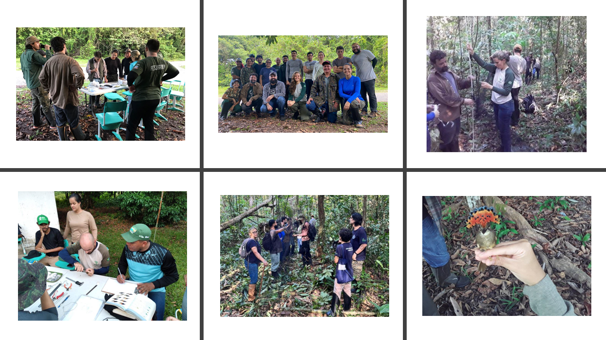
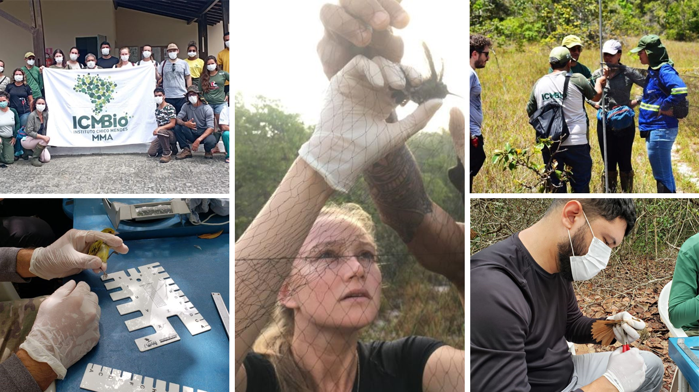
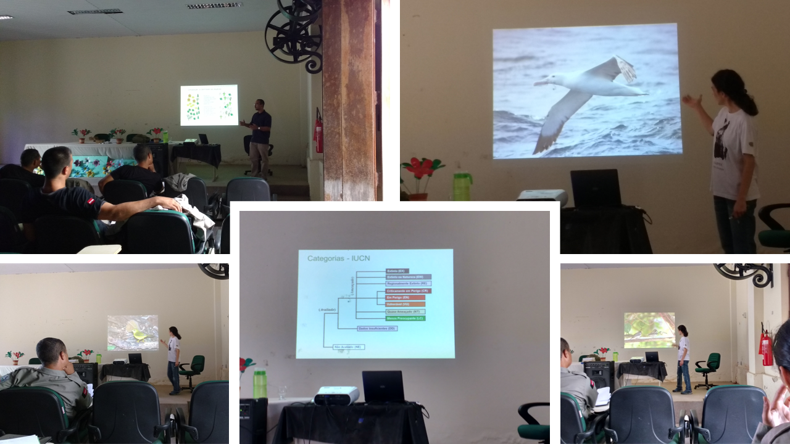
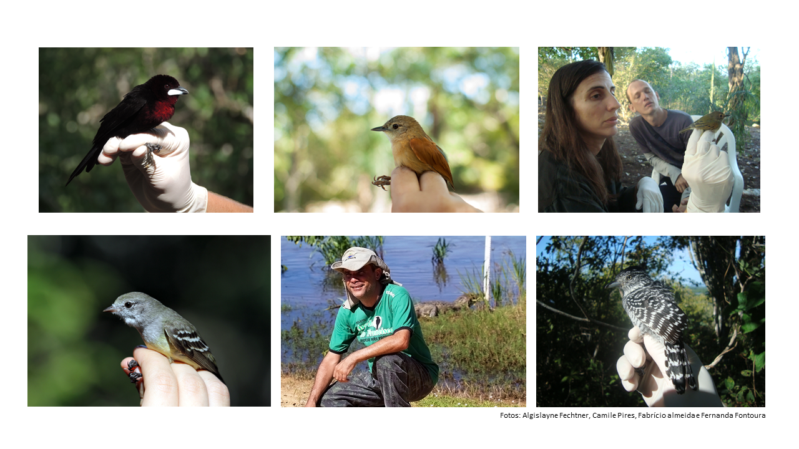
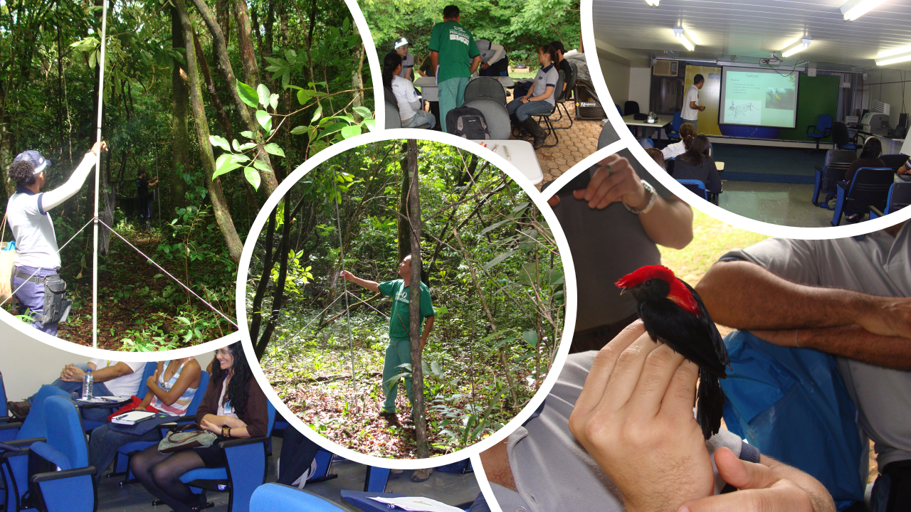
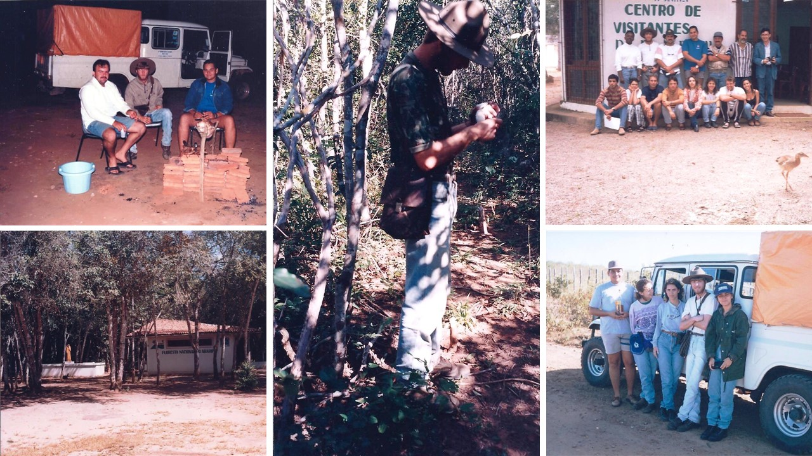
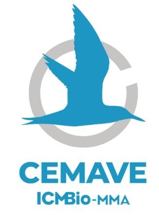
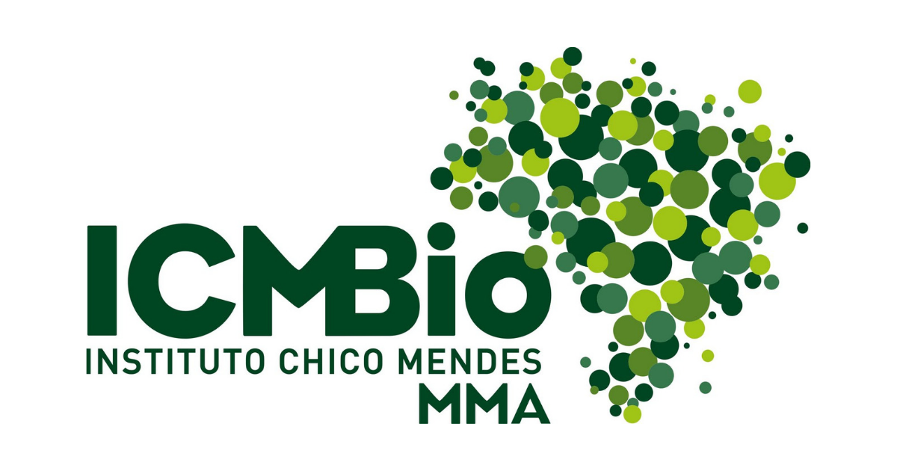

```{r setup, include=FALSE}
library(flexdashboard)
```


```{r libraries, include=FALSE}

library(tidyverse)
library(data.table)
library(descr)
library(RColorBrewer)
library(hrbrthemes)
library(kableExtra)
library(janitor)
library(skimr)
library(knitr)
library(htmltools)
library(DT)
library(leaflet)
library(sf)
library(shiny)
library(plotly)
library(ggthemes)
library(forcats)
library(crosstalk)
#library(summarywidget)
library(skimr)
library(mice)
library(colorRamps)
library(readr)
library(lubridate)
library(skimr)
library(psych)
library(ggplot2)
library(formattable)
library(geobr)

options(knitr.table.format = "html")

#Sys.setlocale('LC_CTYPE','C')
Sys.setlocale("LC_ALL","pt_BR.UTF-8")

```

```{r reading data}

cursos <- read_csv2("data/cursos_cemave_2023.csv") 

participantes <- read_csv2("data/participantes_cemave_2023.csv")

alunos <- read_csv2("data/alunos_cemave_2023.csv")

instrutores <- read_csv2("data/instrutores_cemave_2023.csv")

cursos$ID <- as.character(cursos$ID)
alunos$ID <- as.character(alunos$ID)
instrutores$ID <- as.character(instrutores$ID)

cursos.alunos <- full_join(cursos, alunos, by = "ID")
cursos.instrut <- full_join(cursos, instrutores, by = "ID")

```


```{r}

# ---------- inspecionando a estrutura dos arquivos de dados e tipos de variáveis

#glimpse(cursos)

cursos$ID <- as.character(cursos$ID)
cursos$modalidade <- as.factor(cursos$modalidade)
cursos$latitude <- as.numeric(cursos$latitude)
cursos$longitude <- as.numeric(cursos$longitude)
cursos$ano <- as.factor(cursos$ano)
cursos$participantes <- as.integer(cursos$participantes)
cursos$alunos <- as.integer(cursos$alunos)
cursos$instrutores <- as.integer(cursos$instrutores)
cursos$colaboradores <- as.integer(cursos$colaboradores)
cursos$programa.curso <- as.factor(cursos$programa.curso)
cursos$lista.participantes <- as.factor(cursos$lista.participantes)
cursos$relatorio.descritivo <- as.factor(cursos$relatorio.descritivo)
cursos$fotos <- as.factor(cursos$fotos)
cursos$UF <- as.factor(cursos$UF)
#glimpse(cursos)

```


```{r resumo dos dados, include=FALSE}

# ----------- Resumo dos cursos

total_instrutores <- sum(cursos$instrutores, NA, na.rm = TRUE)
total_dias_curso <- sum(cursos$duracao.dias, NA, na.rm = TRUE)
total_horas_curso <- sum(cursos$carga.horaria, NA, na.rm = TRUE)
total_participantes <- sum(cursos$participantes, NA, na.rm = TRUE)
total_alunos <- sum(cursos$alunos, NA, na.rm = TRUE)
total_colaboradores <- sum(cursos$colaboradores, NA, na.rm = TRUE)

#summary(cursos$alunos)

#summary(cursos$instrutores)

# ---------- Contagens

#freq(cursos$foco.curso, user.missing = c("NA"))
# freq(cursos$municipio, user.missing = c("NA"))
# freq(cursos$UF, user.missing = c("NA"))
# freq(cursos$alunos, user.missing = c("NA"))
freq(cursos$ano, user.missing = c("NA"))
# freq(cursos$UF, user.missing = c("NA"))
# 
# freq(alunos$municipio, user.missing = c("NA"))
# unique(alunos$municipio)
# freq(alunos$UF, user.missing = c("NA"))
# unique(alunos$UF)
# freq(alunos$tipos.inst, user.missing = c("NA"))
# unique(alunos$tipos.inst)
# freq(alunos$instituicao, user.missing = c("NA"))
# unique(alunos$instituicao)
# 
# freq(instrutores$participantes, user.missing = c("NA"))
# freq(instrutores$genero, user.missing = c("NA"))
# freq(instrutores$instituicao, user.missing = c("NA"))
# freq(instrutores$tipos.inst, user.missing = c("NA"))
# unique(instrutores$municipio)
# freq(instrutores$UF, user.missing = c("NA"))
# unique(instrutores$UF)
# 
# unique(instrutores$instituicao)
# unique(instrutores$participantes)
# unique(instrutores$municipio)
# unique(instrutores$UF)
# 
# 
# unique(cursos$municipio)
# unique(cursos$UF)
# unique(cursos$regiao)
# unique(cursos$nome.curso)

```


Informações gerais
===


Column {data-width = 200}
-----------------------------------------------------------------------

### **Cursos ministrados**

```{r}


valueBox(dim(cursos)[1], icon = "fa-binoculars", color = "#00AEAD")
```

### Dias de treinamento

```{r}

valueBox(total_dias_curso, icon = "fa-calendar", color = "#69b3a2")
```


### Horas de aula

```{r}

valueBox(total_horas_curso, icon = "fa-clock-o", color = "#69b3a2")
```


### Participantes

```{r}

valueBox(total_participantes, icon = "fa-users", color = "#69b3a2")
```


### Alunos

```{r}

valueBox(total_alunos, icon = "fa-graduation-cap", color = "#69b3a2")
#"fa-duotone fa-screen-users"

```


### Instrutores

```{r}

valueBox(total_instrutores, icon = "fas fa-chalkboard-teacher", color = "#69b3a2")
```


### Colaboradores

```{r}

valueBox(total_colaboradores, icon = "fas fa-people-carry", color = "#69b3a2")
```

Row {data-height = 380}
-----------------------------------------------------------------------


### **Cursos por área**

```{r echo=FALSE}

# --------------------  Cursos por tema

mycolors <- c("#69b3a2", "#A2D8A2", "#677E67","#458B41", "#dbead5") 

G1 <- cursos %>%
        #filter(!is.na(foco.curso)) %>% 
        mutate(foco.curso = ifelse(is.na(foco.curso), "Sem informação", foco.curso)) %>% 
        group_by(foco.curso) %>%
        summarise(count = n()) %>%
        plot_ly(labels = ~foco.curso,
        values = ~count,
        marker = list(colors = mycolors)) %>%
        add_pie(hole = 0.4) %>%
        layout(xaxis = list(zeroline = F,
                    showline = F,
                    showticklabels = F,
                    showgrid = F),
       yaxis = list(zeroline = F,
                    showline = F,
                    showticklabels=F,
                    showgrid=F))
G1

```


### **Cursos por duração (em dias)**

```{r}

G4 <- cursos %>%
    filter(!is.na(duracao.dias)) %>% 
    ggplot( aes(x = duracao.dias)) +
    geom_histogram(binwidth=1, fill="#69b3a2", color="#e9ecef", alpha=0.9) +
    scale_x_continuous(name = " ") +
    scale_y_continuous(name = " ") +
    theme_minimal() +
    theme(
    panel.grid.minor.y = element_blank(),
    panel.grid.major.y = element_blank(),
    panel.grid.minor.x = element_blank(),
    panel.grid.major.x = element_blank(),
    ) +
    scale_x_continuous(breaks = seq(0, 17, by = 1), name = " ") +
    scale_y_continuous(breaks = seq(0, 20, by = 5), name = " ")

 
ggplotly(G4)

```


### **Cursos por carga horária**

```{r}

G5 <- cursos %>%
    ggplot( aes(x = carga.horaria)) +
    geom_histogram( binwidth=8, fill="#69b3a2", color="#e9ecef", alpha=0.9) +
    theme_minimal() +
    theme(
    panel.grid.minor.y = element_blank(),
    panel.grid.major.y = element_blank(),
    panel.grid.minor.x = element_blank(),
    panel.grid.major.x = element_blank(),
    ) +
    scale_x_continuous(breaks = seq(0, 120, by = 40), name = " ") +
    scale_y_continuous(name = " ") 
      


ggplotly(G5)

```


Row {data-height = 380}
-------------------------------------------------------------------

### **Cursos por década**

```{r}

# ------------------------- Número de cursos por década

tempo.decada <- data.frame(
  decada = c("1978-79", "1980-89", "1990-99", "2000-09", "2010-19", "2020-29"),
  cursos = c(2, 18, 43, 6, 22, 4)
)

G7 <- tempo.decada %>%
    ggplot( aes(x = decada, y = cursos)) +
    geom_col(color = "#e9ecef",  fill="#69b3a2") +
    scale_x_discrete(name = " ") +
    scale_y_continuous(name = " ") +
    theme_minimal() +
   
    theme(
    panel.grid.minor.y = element_blank(),
    panel.grid.major.y = element_blank(),
    panel.grid.minor.x = element_blank(),
    panel.grid.major.x = element_blank(),
    )
   
    
ggplotly(G7)

```


### **Cursos por estado**

```{r cursos por estado}
# ----------------------  Barplot cursos por estado horizontal

G8 <- cursos %>%
        filter(!is.na(UF)) %>% 
        filter(!UF == 'ARG') %>% 
        group_by(UF) %>%
        summarise(count = n()) %>% 
   
        ggplot(aes(x = fct_reorder(UF, count, .desc = F), y = count)) +
        geom_bar(stat="identity", fill="#69b3a2") +
        coord_flip() +
        theme_minimal() +
        theme(
        panel.grid.minor.y = element_blank(),
        panel.grid.major.y = element_blank(),
        legend.position="none") +
        xlab(" ") +
        ylab(" ")

ggplotly(G8)


```


### **Cursos por região**

```{r}

coul5 <- brewer.pal(5, "Pastel2")

G9 <- cursos %>%
        mutate(regiao = recode(UF, "DF" = "Centro-Oeste",
                                   "MT" = "Centro-Oeste",
                                   "MS" = "Centro-Oeste",
                               "TO" = "Centro-Oeste",
                               "DF" = "Distrito Federal", 
                               "AM" = "Norte",
                               "AC" = "Norte",
                               "PA" = "Norte",
                               "RO" = "Norte",
                               "RR" = "Norte",
                               "AP" = "Norte",
                               "BA" = "Nordeste",
                               "CE" = "Nordeste",
                               "MA" = "Nordeste",
                               "PB" = "Nordeste", 
                               "PE" = "Nordeste",
                               "PI" = "Nordeste",
                               "RN" = "Nordeste",
                               "SE" = "Nordeste",
                               "AL" = "Nordeste",
                               "RJ" = "Sudeste",
                               "MG" = "Sudeste",
                               "SP" = "Sudeste",
                               "ES" = "Sudeste",
                               "RS" = "Sul",
                               "PR" = "Sul",
                               "SC" = "Sul")) %>% 
        filter(!is.na(regiao)) %>% 
        filter(!UF == 'ARG') %>% 
        group_by(regiao) %>%
        summarise(count = n()) %>%  
        ggplot( aes(x = fct_reorder(regiao, count, .desc = TRUE), y = count)) +
        geom_col(color = "#e9ecef",  fill= coul5) +
        scale_x_discrete(name = " ") +
        scale_y_continuous(name = " ") +
        theme_minimal() +
        theme(
        panel.grid.minor.y = element_blank(),
        panel.grid.major.y = element_blank(),
        panel.grid.minor.x = element_blank(),
        panel.grid.major.x = element_blank(),
    )
   
ggplotly(G9)

```


Alunos
=========================

Row
-------------------------------------------------------------------

### **Alunos por curso**

```{r imagem Alunos por curso}

# ------------------------  Boxplot - Média de Alunos por curso

fill <- "#69B3A2"
line <- "#767f6d"


G2 <- ggplot(cursos, aes(y = alunos)) +
        geom_boxplot(fill = fill, colour = line, outlier.colour = "#D92926") +
        scale_x_discrete(name = "Alunos") +
        scale_y_continuous(name = "") +
        theme_minimal() +
        theme(
        panel.grid.minor.y = element_blank(),
        panel.grid.major.y = element_blank(),
        panel.grid.minor.x = element_blank(),
        panel.grid.major.x = element_blank()
        ) +
        scale_y_continuous(breaks = seq(0, 120, by = 10), name = " ")

ggplotly(G2)

```

### **Cursistas por gênero**

```{r imagem Cursistas por gênero}

# --------------------  Cursistas por gênero

G10 <- alunos %>%
        mutate(genero = ifelse(genero == "M", "Homem", "Mulher")) %>% 
        filter(!is.na(genero)) %>% 
        group_by(genero) %>%
        summarise(count = n()) %>%
        
        plot_ly(labels = ~genero,
                 values = ~count,
                 marker = list(colors = mycolors)) %>%
        add_pie(hole = 0.4) %>%
        layout(xaxis = list(zeroline = F,
                             showline = F,
                             showticklabels = F,
                             showgrid = F),
                yaxis = list(zeroline = F,
                             showline = F,
                             showticklabels=F,
                             showgrid=F))
G10

```


### **Origem dos alunos por área de atuação**

```{r imagem Áreas de atuação}

# ---------------------  Alunos por áreas de atuação

# origem <- data.frame(
#   area.atuacao = c("Órgãos Ambientais", "Forças Segurança", "Ensino & Pesquisa", "Museus & Afins", "Terceiro Setor", "Empresas", "Área Jurídica"),
#   numero = c(224, 213, 137, 18, 18, 12, 5)
# )

# Usando uma palheta de cores

coul1 <- brewer.pal(8, "Pastel2") 


G11 <- alunos %>%
        filter(!is.na(tipos.inst)) %>% 
        group_by(tipos.inst) %>%
        summarise(count = n()) %>% 

        ggplot( aes(x = fct_reorder(tipos.inst, count, .desc = FALSE), y = count)) +
        geom_col(color = "#e9ecef",  fill= coul1) +
        ylim(0, 300) +
        scale_y_continuous(name = " ") +
        scale_x_discrete(name = " ", labels = c('Setor Jurídico', 'Consultoria', 'Empresas', 'Museus & Afins', 'Terceiro Setor', 'Ensino & Pesquisa', 'Forças de Segurança', 'Órgãos Ambientais')) +
        coord_flip() +
        theme_minimal() +
        theme(
        panel.grid.minor.y = element_blank(),
        panel.grid.major.y = element_blank(),
        panel.grid.minor.x = element_blank(),
        #panel.grid.major.x = element_blank(),
        )

ggplotly(G11)

```


Row
-------------------------------------

### **Alunos por estado**

```{r imagem Alunos por estado}

# ----------------------  Alunos por estado 


G12 <- alunos %>%
        filter(!is.na(UF)) %>% 
        filter(!UF == 'ARG') %>% 
        group_by(UF) %>%
        summarise(count = n()) %>% 
 
        ggplot(aes(x = fct_reorder(UF, count, .desc = F), y = count)) +
        geom_bar(stat="identity", fill="#69b3a2") +
        coord_flip() +
        theme_minimal() +
        theme(
        panel.grid.minor.y = element_blank(),
        panel.grid.major.y = element_blank(),
        ) +
        xlab(" ") +
        ylab(" ")

ggplotly(G12)

```


### **Alunos por região**

```{r imagem Alunos por região}

# ----------------------------  Alunos por região

coul2 <- brewer.pal(5, "Pastel2") 

G13 <-  alunos %>%
        filter(!is.na(regiao)) %>% 
        filter(!regiao == 'ARG') %>% 
        group_by(regiao) %>%
        summarise(count = n()) %>% 

        ggplot( aes(x = fct_reorder(regiao, count, .desc = T), y = count)) +
        geom_col(color = "#e9ecef",  fill= coul2) +
        scale_x_discrete(name = "") +
        scale_y_continuous(name = "") +
        theme_minimal() +
        theme(
        panel.grid.minor.y = element_blank(),
        panel.grid.major.y = element_blank(),
        panel.grid.minor.x = element_blank(),
        panel.grid.major.x = element_blank(),
        )
   
ggplotly(G13)

```


### **Alunos estrangeiros**

```{r imagem Alunos estrangeiros}

# ---------------------------  Alunos por país

# alunos.pais <- data.frame(
#   pais = c("Brasil", "Bolívia", "Argentina", "Peru"), 
#   alunos = c(878, 8, 3, 1)
# )

coul3 <- brewer.pal(6, "Pastel2")


G14 <-  alunos %>%
        filter(!is.na(pais)) %>%
        filter(pais != "Brasil") %>% 
        group_by(pais) %>%
        summarise(count = n()) %>% 

        ggplot(aes(x = fct_reorder(pais, count, .desc = T), y = count)) +
        geom_col(color = "#e9ecef",  fill= coul3) +
        scale_x_discrete(name = "") +
        scale_y_continuous(name = " ") +
        #scale_y_log10(name = " ") +
        theme_minimal() +
        theme(
        panel.grid.minor.y = element_blank(),
        panel.grid.major.y = element_blank(),
        panel.grid.minor.x = element_blank(),
        panel.grid.major.x = element_blank(),
        ) +
        scale_y_continuous(breaks = seq(0, 10, by = 2), name = " ")
   
ggplotly(G14)

```

Instrutoria
=======================

Row 
---------------------------------------------------------------------

### **Instrutores por curso**

```{r imagem Instrutores por curso}

# ------------------------  Boxplot - Instrutores por curso


G3 <- ggplot(cursos, aes(y = instrutores)) +
        geom_boxplot(fill = fill, colour = line, outlier.colour = "#D92926") +
        scale_x_discrete(name = "Instrutores") +
        scale_y_continuous(name = "") +
        theme_minimal() +
        theme(
        panel.grid.minor.y = element_blank(),
        panel.grid.major.y = element_blank(),
        ) +
        #theme(axis.line = element_line(colour = "#FFFFFF", size = 1)
        scale_y_continuous(breaks = seq(0, 16, by = 2.0), name = " ")
       
ggplotly(G3)

```

### **Ações de instrutoria por estado de origem do instrutor**

```{r imagem Instrutoria por estado}

# -----------------------   Instrutoria por estado


G15 <-  instrutores %>%
        filter(!is.na(UF)) %>% 
        group_by(UF) %>%
        summarise(count = n()) %>% 

        ggplot(aes(x = fct_reorder(UF, count, .desc = T), y = count)) +
        geom_col(fill="#69b3a2") +
        xlab("Estados") +
        ylab(" ") +
        theme_minimal() +
        theme(
        panel.grid.minor.y = element_blank(),
        panel.grid.major.y = element_blank(),
        panel.grid.minor.x = element_blank(),
        panel.grid.major.x = element_blank(),
        ) 

ggplotly(G15)

```


Row 
---------------------------------------------------------------------
### **Instrutores com mais participações**


```{r imagem Instrutores mais ativos}

# -------------------------  Instrutores mais ativos

G16 <-  instrutores %>%
        mutate(participantes = recode(participantes,
                      "Albano Schultz Neto"="Albano Schulz Neto")) %>% 
        group_by(participantes) %>%
        summarise(count = n()) %>% 
        arrange(desc(count)) %>% 
        filter(count > 3) %>% 

        ggplot(aes(x = fct_reorder(participantes, count, .desc = F), y = count)) +
        geom_col(color = "#e9ecef",  fill="#69b3a2") +
        coord_flip() +
        theme_minimal() +
        theme(
        panel.grid.minor.y = element_blank(),
        panel.grid.major.y = element_blank(),
        ) +
        xlab(" ") +
        ylab("Cursos ministrados") +
        scale_y_continuous(limits=c(0, 10)) +
        scale_y_continuous(breaks = seq(0, 10, by = 2), name = "Cursos ministrados ")
 
ggplotly(G16)
 
```

### **Áreas de atuação de origem dos instrutores**

```{r Áreas de atuação de origem dos instrutores}

# ---------------------  Instrutores por origem

categorias.instrutores <- data.frame(
  origem = c("Órgãos Ambientais", "Ensino & Pesquisa", "Terceiro Setor", "Museus & Afins", "Forças Segurança", "Empresas"),
  numero = c(119, 31, 23, 4, 2, 1)
)

coul4 <- brewer.pal(6, "Pastel2") 

# color <- colorRampPalette(c("darkgreen","lightgreen"))
# color(6)


G17 <-  instrutores %>%
        filter(!is.na(tipos.inst)) %>% 
        group_by(tipos.inst) %>%
        summarise(count = n()) %>% 
      
        ggplot(aes(x = fct_reorder(tipos.inst, count, .desc = F), y = count)) +
        geom_col(color = "#e9ecef",  fill= coul4) +
        scale_x_discrete(name = " ") +
        scale_y_continuous(name = "Número de instrutores") +
        scale_x_discrete(name = " ", labels = c('Empresas', 'Forças de Segurança', 'Museus & Afins',  'Terceiro Setor',  'Ensino & Pesquisa', 'Órgãos Ambientais')) +
        coord_flip() +
        theme_minimal() +
        theme(
        panel.grid.minor.y = element_blank(),
        panel.grid.major.y = element_blank(),
        ) 
   
ggplotly(G17)

```

Espacialização {data-orientation=columns}
=======================

Column 1 {data-width=400}
-------------------------------------------------------------------


### **Cursos por região**

```{r leitura e pré-processamento dos dados - cursos por região, echo = FALSE}

sf_use_s2(FALSE) # esse código, do pacote sf, serve para ajustar erro de geometria dos polígonos que apareceu após a atualização de versão e permitir a união dos dois shapes abaixo

regioes_sf <- st_read("shapes/regioes_2010.shp", quiet = TRUE)

regioes_sf <- rename(regioes_sf, regiao = nome)

# mapa_regiao <- 
# mapa_regiao <- geobr::read_region()
# 
# mapa_regiao <- mapa_regiao %>% 
#     rename(regiao = name_region)

# mapa_regiao <- mapa_regiao %>%
#         mutate(regiao = recode(regiao, "Centro Oeste" = "Centro-Oeste"))

```


```{r mapa cursos por região, echo = FALSE}

#crs <- leafletCRS(proj4def = "+proj=longlat +datum=WGS84")


cursos_regiao <- data.frame(
    regiao = c("Norte", "Nordeste", "Centro-Oeste", "Sudeste", "Sul"),
    cursos = c(3, 21, 34, 13, 21))

#mapa_regiao <- mapa_regiao %>% st_transform(4326)

dados_mapa_regiao = regioes_sf %>% 
    left_join(cursos_regiao)


legendas_regiao <- dados_mapa_regiao %>% mutate(popup_info = paste (regiao)) # criando uma coluna na tabela de dados com os dados que serão mostrados na janela popup


# dados_mapa_regiao <- dados_mapa_regiao %>% st_transform(4326)

bins <- c(0, 10, 20, 30, 40)
qpal2 = colorBin("Greens", dados_mapa_regiao$cursos, bins = bins)

labels <- sprintf("<strong>%s</strong>", dados_mapa_regiao$cursos) %>% lapply(htmltools::HTML)

mapa_cursos_regiao <- dados_mapa_regiao %>% 
    leaflet() %>%
    setView(lng = -58, lat = -14,
           zoom = 4) %>%
    addPolygons(stroke = TRUE,
              opacity = 1.0,
              fillOpacity = 1.0,
              smoothFactor = 0.5,
              color = "white",
              fillColor = ~qpal2(dados_mapa_regiao$cursos),
              weight = 1,
              label = labels,
              popup = ~legendas_regiao$popup_info,
              labelOptions = labelOptions(
                style = list("font-weight" = "normal",
                             padding = "3px 8px"),
                             textsize = "15px",
                             direction = "auto"),
              highlight = highlightOptions(weight = 1, 
                                 color = "grey",
                                 fillOpacity = 0.9,
                                 bringToFront = T)) %>% 
 
    addLegend(values = ~dados_mapa_regiao$cursos,
             pal = qpal2,
             position = "bottomleft",
             title = "Cursos por região")

mapa_cursos_regiao

```


### **Cursos por estado**


```{r leitura e pré-processamento dos dados - cursos por estado, echo = FALSE}


sf_use_s2(FALSE) # esse código, do pacote sf, serve para ajustar erro de geometria dos polígonos que apareceu após a atualização de versão e permitir a união dos dois shapes abaixo

estados_sf <- st_read("shapes/estados_2010.shp", quiet = TRUE)

estados_sf <- rename(estados_sf, UF = sigla)

# mapa_estado <- geobr::read_state()
# mapa_estado <- mapa_estado %>%
#     rename(UF = abbrev_state)
# mapa_estado <- mapa_estado %>% 
#     rename(regiao = name_region)
# 
# mapa_estado <- mapa_estado %>%
#         mutate(name_state = recode(name_state, "Rio Grande Do Norte" = "Rio Grande do Norte",
#                "Rio Grande Do Sul" = "Rio Grande do Sul",
#                "Mato Grosso Do Sul" = "Mato Grosso do Sul",
#                "Rio De Janeiro" = "Rio de Janeiro"))

# mapa_estado <- mapa_estado %>%
#         mutate(regiao = recode(regiao, "Centro Oeste" = "Centro-Oeste"))   

# cursos2 <- cursos %>%
#     filter(!is.na(UF)) %>%
#     filter(UF != "ARG") %>% 
#         mutate(regiao = recode(UF, "DF" = "Centro-Oeste",
#                                    "MT" = "Centro-Oeste",
#                                    "MS" = "Centro-Oeste",
#                                "TO" = "Centro-Oeste",
#                                "DF" = "Distrito Federal", 
#                                "AM" = "Norte",
#                                "AC" = "Norte",
#                                "PA" = "Norte",
#                                "RO" = "Norte",
#                                "RR" = "Norte",
#                                "AP" = "Norte",
#                                "BA" = "Nordeste",
#                                "CE" = "Nordeste",
#                                "MA" = "Nordeste",
#                                "PB" = "Nordeste", 
#                                "PE" = "Nordeste",
#                                "PI" = "Nordeste",
#                                "RN" = "Nordeste",
#                                "SE" = "Nordeste",
#                                "AL" = "Nordeste",
#                                "RJ" = "Sudeste",
#                                "MG" = "Sudeste",
#                                "SP" = "Sudeste",
#                                "ES" = "Sudeste",
#                                "RS" = "Sul",
#                                "PR" = "Sul",
#                                "SC" = "Sul"))
# 
# cursos2
# glimpse(mapa_estado)
# glimpse(cursos2)
# 
# cursos2$UF <- as.character(cursos2$UF)
# cursos2$regiao <- as.character(cursos2$regiao)
# 
# glimpse(mapa_estado)
# glimpse(cursos2)

# dados_mapa = mapa_estado %>% 
#     left_join(cursos2)

# Plotando os mapas em ggplot

    
# G18 <-  dados_mapa %>%
#         group_by(UF) %>%
#         summarise(count = n()) %>% 
#        
#         ggplot()  +
#             
#     geom_sf(aes(fill = count))
#   #data = NULL,
#   # stat = "sf",
#   # position = "identity",
#   # na.rm = FALSE,
#   # show.legend = NA,
#   # inherit.aes = TRUE)
# 
#             # scale_fill_distiller(pallete = "Reds", direction = 1,
#             #     name = "Cursos por estado", limits = c(1, 30))
# G18
        

```


```{r mapa cursos por estados, echo = FALSE}

cursos_estado <- data.frame(
   UF = c("AM", "BA", "CE", "DF", "ES", "MA", "MG", "MS", "MT", "PA", "PB", "PE", "PI", "PR", "RJ", "RN", "RS", "SC", "SP", "RO", "RR", "AC", "TO", "SE", "AL", "GO", "AP"),
    cursos = c(1, 2, 4, 22, 2, 2, 1, 9, 3, 2, 6, 4, 1, 4, 3, 2, 11, 6, 7, 0, 0, 0, 0, 0, 0, 0, 0))

dados_mapa_estados = estados_sf %>% 
    left_join(cursos_estado)

legendas_estados <- dados_mapa_estados %>% mutate(popup_info = paste (UF)) # criando uma coluna na tabela de dados com os dados que serão mostrados na janela popup

bins <- c(0, 4, 8, 12, 14, 16, 20, 24)
qpal = colorBin("Greens", dados_mapa_estados$cursos, bins = bins)


labels <- sprintf("<strong>%s</strong>", dados_mapa_estados$cursos) %>% lapply(htmltools::HTML)

mapa_cursos_estados <- dados_mapa_estados %>% 
    leaflet() %>%
    setView(lng = -58, lat = -14,
           zoom = 4) %>%
    addPolygons(stroke = TRUE,
              opacity = 1.0,
              fillOpacity = 1.0,
              smoothFactor = 0.5,
              color = "white",
              fillColor = ~qpal(dados_mapa_estados$cursos),
              weight = 1,
              label = labels,
              popup = ~legendas_estados$popup_info,
              labelOptions = labelOptions(
                style = list("font-weight" = "normal",
                             padding = "3px 8px"),
                             textsize = "15px",
                             direction = "auto"),
              highlight = highlightOptions(weight = 1, 
                                 color = "grey",
                                 fillOpacity = 0.9,
                                 bringToFront = T)) %>% 
 
    addLegend(values = ~dados_mapa_estados$cursos,
             pal = qpal,
             position = "bottomleft",
             title = "Cursos por estado")

mapa_cursos_estados

```


Column 2 {data-width=600}
------------------


### **Locais dos cursos e de origem dos alunos e instrutores**

```{r Locais dos cursos e origem de alunos e instrutores }


# Insere Awesome icons

# icon1 <- awesomeIcons(
#   icon = 'fa-binoculars',
#   iconColor = 'brown',
#   library = 'fa',
#   markerColor = "white"
# )


mapa_cursos <- cursos %>% mutate(popup_info = paste ("Treinamento:", nome.curso, "<br/>", "Realizado em:", ano, "<br/>", "Local:", local.curso, "<br/>", "Cidade:", municipio, "<br/>","Estado:", UF, "<br/>", "Modalidade:", modalidade, "<br/>", "Duração em dias:", duracao.dias, "<br/>", "Carga Horária:", carga.horaria)) # criando uma coluna na tabela de dados com os dados que serão mostrados na janela popup

mapa_alunos <- cursos.alunos %>% mutate(popup_info = paste ("Aluno:", participantes.y, "<br/>", "Treinamento:", nome.curso, "<br/>", "Ano de participação:", ano.y, "<br/>", "Instituição de origem:", instituicao, "<br/>", "Local de origem:", municipio.y, "<br/>","UF:", UF.y)) # criando uma coluna na tabela de dados com os dados que serão mostrados na janela popup

mapa_instrutores <- cursos.instrut %>% mutate(popup_info = paste ("Instrutores:", instrutores.origem, "<br/>", "Treinamento:", nome.curso, "<br/>", "Ano de realização:", ano.y, "<br/>")) # criando uma coluna na tabela de dados com os dados que serão mostrados na janela popup


mapa <- leaflet() %>%
  #Base groups
  setView(lng = -58, lat = -14,
           zoom = 4) %>%
  #addProviderTiles(providers$Esri.WorldImagery, group = "Imágenes de ESRI") %>%
  #addProviderTiles(providers$Stamen.TonerLite, group = "Stamen Toner Lite") %>%
  addProviderTiles(providers$OpenStreetMap.Mapnik, group = "Open Street Map") %>%
    # Overlay groups
    
    # addTiles() %>% 
    addCircleMarkers(data = mapa_cursos,
                     lat = ~latitude,
                     lng = ~longitude,
                     #icon = icon1,
                     radius = ~3,
                     group = "Cursos",
                     color = "darkgreen",
                     popup = ~popup_info) %>% # inserindo a janela popup no código
    
    addCircleMarkers(data = mapa_alunos,
                     lat = ~latitude.y,
                     lng = ~longitude.y,
                     radius = ~3,
                     group = "Alunos",
                     color = "gray",
                     popup = ~popup_info) %>% # inserindo a janela popup no código
   
    addCircleMarkers(data = mapa_instrutores,
                    lat = ~latitude.y,
                    lng = ~longitude.y,
                    radius = ~3,
                    group="Instrutores",
                    color = "brown",
                    popup = ~popup_info) %>%  # inserindo a janela popup no código
   
# Layers Control

    addLayersControl(
        baseGroups = c("OpenStreetMap"),
                       #"Stamen Toner Lite)"),
                       #"Imágenes de ESRI"), 
        overlayGroups = c("Cursos",
                          "Alunos",
                          "Instrutores"),
        options = layersControlOptions(collapsed = FALSE,
                                       autoZIndex = TRUE)) %>%
  addEasyButton(easyButton(
    icon="fa-globe", title="Zoom to Level 4",
    onClick=JS("function(btn, map){ map.setZoom(4); }"))) %>% 
  addMeasure(
    position = "bottomleft",
    primaryLengthUnit = "meters",
    primaryAreaUnit = "sqmeters",
    activeColor = "#3D535D",
    completedColor = "#7D4479")

mapa %>% hideGroup(c("Alunos", "Instrutores"))

```


Consultas 
=========================

Row {data-height = 200}
-------------------------------------------------------------------

### **Cursos por ano**

```{r figura cursos por ano, echo = FALSE}

cursos_tempo <- data.frame(
  ano = c("1978", "1979", "1980", "1981", "1982", "1983", "1984", "1985", "1986", "1987", "1988", "1989", "1990", "1991", "1992", "1993", "1994", "1995", "1996", "1997", "1998", "1999", "2000", "2001", "2002", "2003", "2004", "2005", "2006", "2007", "2008", "2009", "2010", "2011", "2012", "2013", "2014", "2015", "2016", "2017", "2018", "2019", "2020", "2021", "2022"),
  cursos = c(1,  1,  1, 1, 3, 3, 0, 1, 1, 2, 4, 2, 3, 9, 0, 6, 7, 5, 2, 4, 4, 3,     3, 0, 0, 0, 0, 0, 2, 0, 1, 0, 0, 2, 1, 1, 1, 3, 1, 2, 6, 5, 1, 0, 3))

G50 <- cursos_tempo %>%
        ggplot(aes(ano, cursos, group = 1)) +
        geom_point(color = "#69b3a2", size = 2) +
        geom_line(color = "#008000") +
        theme_minimal() + 
        theme(
        #panel.grid.minor.y = element_blank(),
        #panel.grid.major.y = element_blank(),
        panel.grid.minor.x = element_blank(),
        panel.grid.major.x = element_blank(),
        ) +
        xlab("Ano") +
        ylab(" ") +
        #ylim(0, 10) +
        scale_y_continuous(breaks = seq(0, 12, by = 2))

ggplotly(G50)
   
```

Row {data-height=800 .tabset .tabset-fade}
-------------------------------------------------------------------

### **Lista dos cursos**

```{r lista de cursos}

cursos$duracao.dias <- as.integer(cursos$duracao.dias)

tabela_cursos <- subset(cursos, select = -c(ID, periodo, carga.horaria,  organizadores, categoria, latitude, longitude, instrutores.origem, programa.curso, lista.participantes, relatorio.descritivo, fotos, origem.informacoes, observacoes))

tabela_cursos <- tabela_cursos %>%
        mutate(UF = recode(UF,
                              "ARG"= " "))
tab1 <- tabela_cursos %>% 
    select(ano, nome.curso, foco.curso, modalidade, duracao.dias, local.curso, municipio, UF, participantes, alunos, instrutores, colaboradores) %>% 
    arrange(desc(ano)) 


lista_cursos <- datatable(tab1,
          caption = 'Tabela 1. Lista de cursos ministrados pelo CEMAVE de 1978 a 2022.',
          
          colnames = c('Ano', 'Nome do curso', 'Tema', 'Modalidade', 'Duração (dias)', 'Local', 'Município', 'UF',  'Nº Participantes', 'nº Alunos', 'Nº Instrutores', 'Nº Colaboradores'),
          
          extensions = 'Buttons',
                           elementId = NULL,
                           # extensions= "Scroller",
                           style="bootstrap",
                           class="stripe hover",
                           width="80%",
                           rownames = F,
                           autoHideNavigation = T,
                           escape =FALSE,
                           filter = "top",
                           options=list(deferRender=TRUE,
                                   pageLength = 15,
                                   scrollY=300,
                                   dom = 'Bfrtip', 
                         #buttons = c('copy', 'csv', 'excel', 'pdf')))
                         buttons = list('copy', 'print', list(
        extend = 'collection',
        buttons = c('csv', 'excel'),
        text = 'Download'))))

lista_cursos  
    
    
```


### **Lista de participantes**

```{r lista de participantes, echo = FALSE}


participantes$ID = as.character(participantes$ID)

tabela_participantes <- subset(participantes, select = -c(categ, genero, tipo.inst, latitude, longitude))


tab_participantes <- tabela_participantes %>%
        mutate(tipos.inst = recode(tipos.inst,
                              "empresas" = "Empresa",
                              "orgao-ambiental" = "Órgão Ambiental",
                              "terceiro-setor" = "Terceiro Setor",
                              "ensino-pesquisa" = "Ensino & Pesquisa",
                              "museus-afins" = "Museus & afins",
                              "consultoria" = "Consultoria",
                              "setor-juridico" = "Setor Jurídico",
                              "forças-seguranca" = "Forças de Segurança"
                              )) %>% 


        mutate(curso = recode(ID,
"001"="XIII Curso A Ornitologia na Conservação das Aves Silvestres",
"002"="Técnicas de Pesquisa e Conservação em Aves Silvestres",
"003"="A Ornitologia na Conservação de Aves Silvestres",
"004"="A Ornitologia e a Conservação de Aves Silvestres",
"005"="Introdução ao Anilhamento de Aves Silvestres",
"006"="Aves como Bioindicadores para Monitoramento de UCs",
"007"="Curso Básico de Anilhamento de Aves Silvestres",
"008"="I Curso Paranaense de Anilhamento de Aves",
"009"="Anilhamento de Aves - Noções Básicas e Aplicações",
"010"="Tópicos de Ornitologia e Conservação de Aves Silvestres",
"011"="I Curso Nordestino de Anilhamento de Aves Silvestres",
"012"="Noções sobre o Uso de Aves como Indicadores Biológicos das Condições Ambientais",
"013"="XII Curso de Anilhamento de Aves: Uso do Anilhamento na Conservação de Aves Silvestres",
"014"="I Curso de Anilhamento de Aves Silvestres do Arquipélago de Fernando de Noronha",
"015"="IV Curso de Observação e Anilhamento de Aves",
"016"="Curso de Observação e Identificação de Aves",
"017"="I Curso de Anilhamento e Observação de Aves Silvestres Brasileiras",
"018"="I Seminário de Monitoramento de Aves Silvestres em Unidades de Conservação de Santa Catarina",
"019"="II Curso de Observação e Anilhamento de Aves",
"020"="VIII Curso de Anilhamento de Aves Silvestres",
"021"="XI Curso de Anilhamento de Aves",
"022"="O Uso do Anilhamento na Conservação das Aves Silvestres",
"023"="A Ornitologia na Conservação das Aves Silvestres",
"024"="A Ornitologia na Conservação das Aves Silvestres",
"025"="Técnicas de Pesquisa e Conservação de Aves Silvestres",
"026"="Curso Básico de Anilhamento de Aves Silvestres",
"027"="Curso Nacional de Anilhamento de Aves Silvestres",
"028"="I Curso de Anilhamento de Aves Marinhas para Equipes de Projetos de Monitoramento de Praias (PMPs)",
"029"="Técnicas de Pesquisas com Aves Silvestres",
"030"="Curso de Anilhamento de Aves Silvestres",
"031"="Curso de Anilhamento de Aves Silvestres",
"032"="Curso de Anilhamento de Aves Silvestres",
"033"="Curso de Anilhamento de Aves Silvestres",
"034"="Curso de Anilhamento de Aves Silvestres",
"035"="Noções Básicas para Identificação de Aves Silvestres",
"036"="Curso Básico de Anilhamento de Aves Silvestres",
"037"="Curso em Identificação, Manejo e Destinação das Espécies  Alvo do PAN Papagaios",
"038"="Curso em Identificação, Manejo e Destinação das Espécies  Alvo do PAN Papagaios",
"039"="Curso em Identificação, Manejo e Destinação das Espécies  Alvo do PAN Papagaios",
"040"="Curso em Identificação, Manejo e Destinação das Espécies  Alvo do PAN Papagaios",
"041"="Curso em Identificação, Manejo e Destinação das Espécies  Alvo do PAN Papagaios",
"042"="Curso em Identificação, Manejo e Destinação das Espécies  Alvo do PAN Papagaios",
"044"="I Workshop de Capacitação de Agentes do Ibama para Fiscalização da IN nº 07/2014",
"045"="Ecologia e Conservação de Aves",
"046"="Reconhecimento e Manejo de Aves Silvestres",
"047"="Técnicas de Pesquisa e Conservação de Aves Silvestres",
"048"="XIV Curso 'A Ornitologia na Conservação de Aves Silvestres'",
"049"="A Ornitologia e a Conservação das Aves Silvestres",
"050"="Técnicas de Pesquisa e Conservação de Aves Silvestres",
"051"="Treinamento em Técnicas de Monitoramento de Aves Silvestres",
"052"="A Ornitologia na Conservação das Aves Silvestres",
"054"="X Curso de Anilhamento de Aves",
"055"="IX Curso de Anilhamento de Aves",
"056"="A Ornitologia na Conservação das Aves Silvestres",
"057"="",
"058"="",
"059"="",
"060"="Treinamento para o Instituto Estadual de Florestas - IEF/SP",
"061"="I Curso de Extensão em Biologia das Aves Silvestres",
"062"="Mini-curso de Anilhamento",
"063"="Treinamento para a Companhia Energética de São Paulo - CESP",
"064"="Curso de Anilhamento de Aves Migratórias Continentais",
"065"="",
"066"="",
"067"="Treinamento de Pessoal para a Associação Vila-Velhense de Proteção Ambiental",
"068"="Treinamento para Dirección de Ecologia - Ministério de Agricultura, Ganaderia, Industria y Comércio",
"069"="Treinamento para o CENAQUA",
"070"="Curso de Anilhamento - Aracruz Florestal",
"071"="Noções de Anilhamento de Aves Silvestres e Usos em Conservação da Natureza - I",
"072"="Noções de Anilhamento de Aves Silvestres e Usos em Conservação da Natureza - II",
"073"="Noções de Anilhamento de Aves Silvestres e Usos em Conservação da Natureza - III",
"074"="I Treinamento para Censos de Aves Aquáticas no Brasil",
"075"="Técnicas de Captura, Identificação e Anilhamento de Aves Migratórias",
"076"="Mini-curso Conservação e Manejo de Aves Silvestres",
"077"="Treinamento de Biólogos",
"078"="Mini-curso Anilhamento de Aves Silvestres",
"079"="Treinamento para o Centro de Vida Silvestre/UNESP e Centro de Desenvolvimento Agropecuário do Médio Vale do Paranapanema",
"080"="Mini-curso A Ornitologia na Conservação de Aves Silvestres",
"081"="Treinamento de três biólogos",
"082"="Curso de Anilhamento e Censo de Zenaida auriculata em São Pedro do Ivaí",
"083"="Treinamento de Biólogos",
"084"="Treinamento de Biólogos",
"085"="",
"086"="Conservação das Aves Silvestre - Noções Básicas",
"087"="A Ornitologia na Conservação das Aves Silvestres",
"088"="",
"089"="",
"090"="Identificação e Conservação de Aves Silvestres - Noções Básicas",
"091"="Mini-curso de Educação Ambiental - Noções Básicas de Conservação através do Estudo de Aves",
"092"="Mini-curso - Ornitologia e Conservação de Aves Marinhas",
"093"="Curso Regional de Introdução ao Anilhamento",
"094"="Curso para a Conservação e Monitoramento de Aves Marinhas",
"095"="Curso Básico de Anilhamento de Aves Silvestres - Parte Teórica",
"096"="Curso Básico de Anilhamento de Aves Silvestres - Parte Prática",
"097"="Curso Básico de Anilhamento de Aves Silvestres - Parte Prática")) %>% 

        mutate(local = recode(ID,
"001"="Base de Estudos do Pantanal - Passo do Lontra ",
"002"="Estação Ecológica do Taim",
"003"="Parque Nacional de Brasília",
"004"="Base de Estudos do Pantanal - Passo do Lontra ",
"005"="Estação Ecológica Serra das Araras",
"006"=" Floresta Nacional de Ipanema - ACADEBIO",
"007"="Reserva Biológica de Guaribas",
"008"="Refúgio Biológico de Bela Vista",
"009"="Londrina",
"010"="Parque Nacional do Itatiaia",
"011"="Natal",
"012"="Baía de São Marcos - Ilha do Cajual",
"013"="Base de Estudos do Pantanal - Passo do Lontra ",
"014"="Parque Nacional Marinho de Fernando de Noronha",
"015"="Estação Ecológica do Taim",
"016"="Fazenda Campo Grande",
"017"="Parque Nacional de Brasília",
"018"="Estação Ecológica de Carijós",
"019"="",
"020"="Parque Nacional da Lagoa do Peixe",
"021"="Estação Ecológica do Tapacura e Base de Pesquisa em Aves Migratórias da Coroa do Avião",
"022"="Floresta Nacional do Araripe e Estação Ecológica de Aiuaba",
"023"="Parque Nacional de Brasília",
"024"="Estação Ecológica de Aiuaba e Floresta Nacional do Araripe-Apodi",
"025"="Base de Estudos do Pantanal - Passo do Lontra ",
"026"="Floresta Nacional Araripe-Apodi",
"027"="Parque Nacional do Pantanal Matogrossense",
"028"="Hotel Costa do Atlântico",
"029"="Parque Nacional de Brasília",
"030"="Parque Nacional de Brasília",
"031"="Parque Nacional de Brasília",
"032"="Parque Nacional de Brasília",
"033"="Parque Nacional de Brasília",
"034"="Parque Nacional de Brasília",
"035"="Parque Nacional de Brasília",
"036"="Parque Nacional de Brasília",
"037"="Parque Zoobotânico de Salvador",
"038"="Sede do Batalhão da Polícia Ambiental Força Verde - PMPR",
"039"="Jardim Zoológico do Rio de Janeiro - RioZoo",
"040"="Sede do Comando do Policiamento Militar Ambiental - CPMA",
"041"="Fundação Parque Zoológico de São Paulo",
"042"="Instituto de Meio Ambiente do Mato Grosso do Sul - IMASUL",
"044"="Base Multifuncional do CEMAVE em Florianópolis, SC - ESEC Carijós",
"045"="",
"046"="Jardim Botânico Benjamim Maranhão",
"047"="Armação de Itapocoroy",
"048"="Base de Estudos do Pantanal - Passo do Lontra ",
"049"="Superintendência Estadual do Ibama",
"050"="Base de Estudos do Pantanal - Passo do Lontra ",
"051"="Usina Nova América",
"052"="Fazenda Branda",
"053"="Parque Metropolitano de Pituaçu",
"054"="Estação Ecológica do Taim",
"055"="Praia da Coroa do Avião",
"056"="Parque Estadual do Caracol",
"058"="Estação Ecológica do Taim",
"059"="Parque Nacional do Itatiaia",
"060"="Ilha do Cardoso",
"061"="Estação Ecológica do Tapacurá- EET-UFRPE",
"062"="Universidade Federal do Piauí",
"063"="UHE Porto Primavera",
"064"="",
"066"="Parque Nacional da Lagoa do Peixe",
"067"="",
"068"="",
"069"="Porto Trombetas",
"070"="Aracruz Florestal",
"071"="Parque Nacional de Brasília",
"072"="Parque Nacional de Brasília",
"073"="Parque Nacional de Brasília",
"074"="Estação Ecológica do Taim",
"075"="Baía de São Marcos - Ilha do Cajual",
"076"="",
"077"="",
"078"="Universidade Federal de Pelotas",
"079"="Centro de Vida Silvestre/UNESP e Centro de Desenvolvimento Agropecuário do Médio Vale do Paranapanema",
"080"="Parque Nacional de Brasília",
"081"="Parque Nacional de Brasília",
"082"="",
"083"="Parque Nacional de Brasília",
"084"="Parque Nacional de Brasília",
"085"="Parque Nacional de Brasília",
"086"="Jardim Botânico de João Pessoa, PB",
"087"="Campus Avançado da Universidade do Vale de Itajaí - UNIVALI",
"088"="Base de Estudos do Pantanal - Passo do Lontra ",
"089"="Base de Estudos do Pantanal - Passo do Lontra ",
"090"="Parque Nacional de Brasília",
"091"="",
"092"="Campus Avançado da Universidade do Vale de Itajaí - UNIVALI",
"093"="Reserva Biológica de Guaribas",
"094"="Universidade Católica de Santos - UNISANTOS",
"095"="",
"096"="Campus da Universidade Federal Rural da Amazônia - UFRA",
"097"="Reserva Biológica de Guaribas")) %>% 

mutate(participantes = recode(participantes,
                      "Albano Schultz Neto"="Albano Schulz Neto")) %>% 
                      
#tab_participantes2 <- tab_participantes %>%
    #filter(is.na()) %>%
    arrange(desc(ano), desc(ID), curso, UF, participantes) %>%
    select(- ID) %>% 
    select(ano, participantes, curso, local, categoria, instituicao, tipos.inst,  municipio, UF, regiao, pais)

lista_cursos <- datatable(tab_participantes,
          caption = 'Tabela 2. Lista de participantes nos cursos ministrados pelo CEMAVE de 1978 a 2022.',

          colnames = c('Ano', 'Participante', 'Curso', 'Local',  'Condição', 'Instituição', 'Tipo de Instituição', 'Município', 'UF', 'Região', 'País'),

          extensions = 'Buttons',
                           elementId = NULL,
                           #extensions= "Scroller",
                           style="bootstrap",
                           class="stripe hover",
                           width="80%",
                           rownames = F,
                           autoHideNavigation = T,
                           escape =FALSE,
                           filter = "top",
                           options=list(deferRender=TRUE,
                                   pageLength = 15,
                                   autowidth=T,
                                   scrollY=300,
                                   scroller = TRUE,
                                   dom = 'Bfrtip',
                         #buttons = c('copy', 'csv', 'excel', 'pdf')))
                         buttons = list('copy', 'print', list(
        extend = 'collection',
        buttons = c('csv', 'excel'),
        text = 'Download'))))

lista_cursos

    
```

                           
    
<!-- formatStyle('Taxon',  fontWeight = 'italic', fontStyle = 'italic', `text-align` = 'left') %>%  -->

<!-- formatStyle(columns = c("Nome.comum"), `text-align` = 'left') %>% -->
<!-- formatStyle(columns = c("Familia"), `text-align` = 'center') %>% -->
<!-- formatStyle(columns = c("Status.global"), `text-align` = 'center') %>% -->
<!-- formatStyle(columns = c("Status.nacional"), `text-align` = 'center') %>% -->
<!-- formatStyle(columns = c("Area.de.ocorrencia.predominante"), `text-align` = 'center') %>% -->

Imagens {.storyboard}
=========================================

### **Curso Básico de Anilhamento de Aves Silvestres - Parte Prática** - 2022


```{r imagens1}

 


```

***

Campus da Universidade Federal Rural da Amazônia - UFRA  


Belém, PA  

**21 a 25/11/2022**  


**Alunos**

- Ana Sílvia Sardinha Ribeiro
- Antônio Basílio Guerreiro Júnior
- Beatriz Tavares Pinheiro
- Dênis Domingues
- Dimas Augusto Molina Marín
- Éric Barbosa Gonzaga
- Érikson Bruno Loseiro Ferreira
- Karolina Araújo Viana
- Kauê Felippe de Moraes
- Matheus Félix Martins Paiva
- Rubens Ramos Dias
- Tauãn dos Santos Matos
- Willian Ricardo da Silva Fernandes
- Danielson Aleixo
- Arianne Silva Carreira
- Francisco Amilton dos Santos
- Liliane Leal das Chagas
- Patrícia Dittmar Americano da Costa


**Instrutores**

- Aílton Carneiro de Oliveira
- Érika Machado Costa Lima
- Maximiliano Niedfeld Rodriguez
- Marcos Pérsio Dantas Santos


### **Curso Básico de Anilhamento de Aves Silvestres - Parte Prática** - 2022


```{r imagens2}

 


```

***

Reserva Biológica de Guaribas  


Mamanguape, PB  

**07 a 11/11/2022**  


**Alunos**

- Caroline Vieira Cooke
- Dayse Alves Jora
- Havany Fonseca Fontana Neta
- Mariane Rodrigues Guedes
- Felipe Braga Pereira
- Larissa Nayara de Sousa Amaral
- Paulo Cunha Ferreira Bringel
- Gabriele Andreia da Silva
- Victória Carolina Costa Faria
- Leonardo Victor Soares Pinheiro
- Otávio da Cruz Almeida Rocha
- Arlindo Gomes Filho
- Aucimir Oliveira de Melo
- Camila Garcia Gomes
- Sáskia Milbratz
- Francisco Virginio de Souza
- Flávia Vieira de Oliveira Aguiar
- Aline Ramos Souza


**Instrutores**

- Affonso Henrique Nascimento de Souza
- Cristiano Marcelo da Silva Nascimento
- Elivan Arantes de Souza 
- Roberto Cavalcanti Barbosa Filho


### **Reconhecimento e Manejo de Aves Silvestres** - 2015


```{r imagens3}

 


```

***

Jardim Botânico Benjamin Maranhão  


João Pessoa, PB  

**26/11/2015**  


**Alunos**

- Sem informação

**Instrutores**

- Priscilla Prudente do Amaral
- Diego Mendes Lima


### **Curso Nacional de Anilhamento de Aves Silvestres** - 2013


```{r imagens4}

 


```

***

Parque Nacional do Pantanal Matogrossense  


Poconé, MT  

**10 a 14/06/2013**  


**Alunos**

- Alberto Felipe Klotz
- Algislayne  Fechtner Coenga
- Andreia Quandt Monteiro                                                                                                                                                        
- Camila Martins Pires
- Fabricio Basilio Almeida
- Fabrícia Campello
- Fernanda Mussi Fontoura
- Jerry
- Luiz Carlos Souza Pereira
- Marcello Vicente Lourenço
- Marcos Hiroshi Taniwaki
- Marcus Vinicius Falcão Paredes
- Paulo Jardel Braz Faiad
- Paulo Rodrigo Silvestro                                                                                                                                                          
-  Rafael Amaral                                                                                                                                               
-  Roberta Marcatti de Azevedo


**Instrutores**

- Aílton Carneiro de Oliveira
- Antonio Emanuel Barreto Alves de Sousa
- Dalci Mauricio Miranda de Oliveira


### **Curso Básico de Anilhamento de Aves Silvestres** - 2012


```{r imagens5}

 


```

***

Parque Nacional de Brasília  


Brasília, DF

Curso para INFRAERO

**05 a 09/11/2012**  

**Alunos**  

- Adriana Vaz dos Santos
- Aline Silva dos Anjos
- Ana Aparecida de Freitas Lima
- Ana Paula Fagundes
- Angela Sanches Domingues
- Camila de Mesquita Lopes
- Gabriel F. Fernandes
- Leila Ramos Neves
- Leonardo Martha de Souza Lima
- Lorena e Silva Monte de Almeida
- Luciéle Cristina Rosa
- Maiara Lenise Lutz
- Matheus Sanches
- Michelle da Cunha Torres
- Paulo Vinicius Davanço
- Pedro Santos
- Rochele VaSuloncelos Castelo Branco Mourão
- Rossana de Paula Vilamiu
- Thaíse Leandro Barbosa
- Tiago Porto Aranha


**Instrutores**

- Aílton Carneiro de Oliveira
- Antonio Emanuel Barreto Alves de Sousa
- Roberta


### **O Uso do Anilhamento na Conservação das Aves Silvestres** - 1994


```{r imagens6}

 


```

***

Floresta Nacional do Araripe-Apodi e Estação Ecológica de Aiuaba  


Crato, CE


**25/05 a 06/06/1994**  

**Alunos**  

- Antônio Sabino da Silva
- Carlos Albécio Maia
- Carlos Leal Filho
- Francisco Daxo Leal Alencar
- Gilmário Agostinho dos Santos
- Irisney Antunes Marques
- Márcia Maria Moraes Gonçalves
- Tânia Pereira Santana
- Gláucia Jordão Zerbini
- Elivan Arantes de Souza
- Flávio Roberto de Alencar Roza


**Instrutores**

- João Luiz Xavier do Nascimento
- Severino Mendes de Azevedo Junior
 


Sobre {data-orientation=columns}
======================================


Column-1 {data-width=500}
------------------------------------------------------------------

### Última atualização deste Relatório: **05/04/2023**


#### **Os cursos ministrados pelo CEMAVE**

Este relatório apresenta os resultados da compilação, sistematização e análise dos dados relativos aos cursos ministrados pelo Centro Nacional de Pesquisa e Conservação de Aves Silvestres – CEMAVE no período de 1978 a 2022. Esta iniciativa teve como objetivo organizar as informações referentes ao esforço de capacitação realizado pelo Centro ao longo de sua existência e disponibilizá-las ao público em geral. Ressaltamos que para alguns cursos (especialmente os mais antigos) foram obtidas apenas informações parciais. Em alguns casos, por exemplo, obteve-se o número de alunos participantes, mas não foi localizada a lista dos nomes e instituições de origem. Para outros cursos a carga horária foi estimada a partir do programa e houve ainda casos em que não foi possível idenficar o ano de execução. Por essas razões, a quantidade de registros variou entre os diversos aspectos analisados e os resultados apresentados refletem as limitações dos dados. Apesar das lacunas identificadas, procurou-se extrair a maior quantidade possível de informações do conjunto de dados disponível.

Nas primeiras décadas predominaram no CEMAVE os cursos sobre aves com foco em atividades práticas em campo (p. ex.: capturas com redes de neblina, anilhamento, identificação e registros comportamentais) e que incluiam a execução de pequenos projetos em grupo ou individualmente. Os cursos eram, em geral, mais longos (9, 10, 11, até 17 dias). Com o passar dos anos houve uma tendência de redução na duração dos cursos, com uma progressiva convergência e predomínio de cursos com 5 dias (40 horas – uma semana). Esses treinamentos, com foco nas atividades práticas de campo e capacitação para o anilhamento estão, até hoje, fortemente associados à imagem institucional do CEMAVE como centro especializado em pesquisa e conservação de aves, nacionalmente conhecido e reconhecido pela comunidade ornitológica do país. As iniciativas de capacitação do Centro estão intrinsicamente ligadas ao seu próprio processo de criação e ao interesse e necessidade existentes, à época, na formação de profissionais para atuar na pesquisa e conservação de aves no Brasil.  

Ao longo dos anos o Centro ministrou também cursos de menor duração, voltados à capacitação de um público atuante na área de fiscalização/proteção e reabilitação de aves (cursos voltados especialmente aos fiscais do Ibama, de órgãos ambientais estaduais e também a profissionais de Centros de Triagem de Animais Silvestres - CETAS). A demanda por esse tipo de curso vem aumentando em anos recentes, reflexo possivelmente também das ações previstas nos Planos de Ação Nacionais para a conservação de espécies ameaçadas. Nos últimos anos têm surgido ainda demandas pontuais no âmbito acadêmico para cursos mais teóricos sobre biologia e conservação de aves e sobre as ações desenvolvidas pelo CEMAVE, incluindo treinamentos para o uso de aves em programas de monitoramento. Esse cenário geral parece ter contribuído para o aumento do número de cursos ministrados no período de 2010 a 2020.

Os cursos ministrados pelo CEMAVE têm uma grande abrangência tanto em termos geográficos quanto em relação à área de atuação de origem dos alunos. Já ministramos cursos em grande parte dos estados brasileiros, para alunos com diferentes perfis de atuação profissional, provenientes de 26 estados e de todas as regiões do país (além de alguns alunos de países vizinhos).


Interessado em algum curso oferecido pelo CEMAVE?  

Visite regularmente [nosso site](https://www.gov.br/icmbio/pt-br/assuntos/centros-de-pesquisa/aves) e siga nosso [instagram](https://www.instagram.com/icmbio.cemave/?hl=pt) para receber informações sobre o lançamento dos editais para nossos treinamentos.  


Column-2 {data-width = 500}
-------------------------------------

### **Fale conosco**

####

<div style='display:flex; flex-direction:row; justify-content:space-evenly; align-items:center;'>

<div>


<center>[{width=40% height=25%}](https://www.gov.br/icmbio/pt-br/assuntos/centros-de-pesquisa/aves) [{width=40% height=40%}](https://www.ibama.gov.br/sna/recuperacao.php)</center>


<br>

</div>


</div>


<center>


**Centro Nacional de Pesquisa e Conservação de Aves Silvestres - CEMAVE**  
Floresta Nacional da Restinga de Cabedelo – ICMBio  
BR-230 - Km 10 Renascer  
58108-012 Cabedelo, PB  

Tels: 83 3245-5001 / 3245-5278  
*cemave.sede@icmbio.gov.br*


<br>

-------------------------------------------------------------------------------


<center>[{width=40% height=20%}](https://www.gov.br/icmbio/pt-br)</center>


**Instituto Chico Mendes de Conservação da Biodiversidade - ICMBio**  
Complexo Administrativo EQSW 103/104 s/n  
Cruzeiro/Sudoeste/Octogonal  
70670-350 Brasília, DF   

</center>